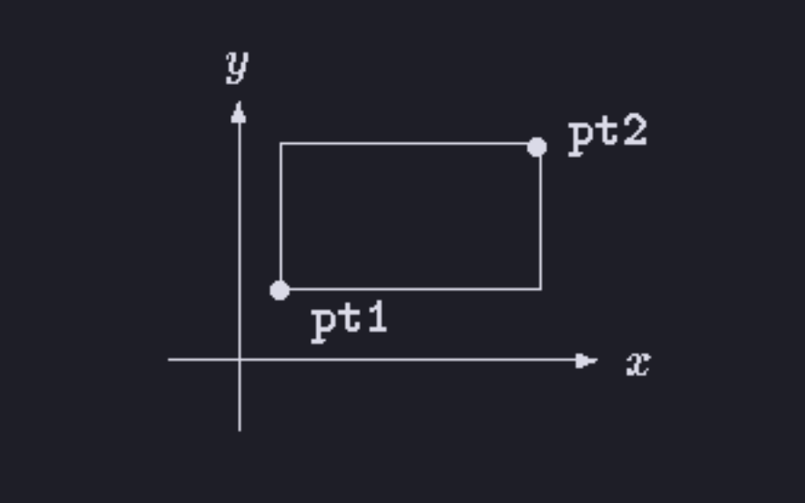

## 1.1 Getting Started

The only way to learn a new programming language is by writing programs in it, so the first program we will write is the popular **Hello, World!** program

In the **C language** printing **"Hello, World!”** is like this

```c
#include <stdio.h>
/*
- Book Explanation
	include information about standard library
  define a function called main
  that received no argument values
  statements of main are enclosed in braces
  main calls library function printf
  to print this sequence of characters
  \n represents the newline character
*/
int main() {
	printf("Hello, Wrold!\n");
}
```

The file that has the code should end with the ".c” extension, to run it depends on the system used for example there are `cc hello.c`, `gcc hello.c` or `clang hello.c` all this commands produce an executable file like this "a.out” or "hello”.

when it gets executed the "**Hello, World!**” will be printed in the terminal.

So A **C** program whatever it's size its size, consists only of functions, variables and the functions contain statements, so C is a functional language.

in the above example we have a function with the name `main` so the name main in **C** is a special, it is were the program start executing that means that every program must have a main function somewhere.

main usually call other functions to preform it's job, as you can see in the example above we have a `printf` function inside `main`, this function is not implemented in our example, so where is it?

In the top of our code there is the `#include <stdio.h>` a header that tells the compiler to include information about the `Standard input/output library` where the `printf` function is defined and implemented.

Functions communicate and share data with each other using _arguments_ inside `()`_,_ in our `main` implementation we didn't provide any arguments to it.

A function can be called by using it's name and parentheses `printf()` , this function takes a lot of arguments but in out example it takes just the string **"Hello, World!”.**

The `\n` is a C notation of new line, it's _escape sequence character,_ we will know more about those later, so `\n` informs `printf` to print a new line to understand it more we can implement the same Hello, World! program like this ways

```c
#include <stdio.h>

main() {
	printf("hello, ");  // no new line
	printf("world!");    // no new line
	printf("\n");       // new line here
}
```

```c
#include <stdio.h>

main() {
	printf("hello, World!");  // no new line
	printf("\n");       // new line here
}
```

Basically you can imaging a program that print each character it self then at the end prints new line, all would have the same output.

### Exercise 1-2.

Experiment to find out what happens when prints's argument string contains `\c`, where c is some character not listed above.

```c
#include <stdio.h>

int main(void) {
	printf("Hello, world! \c\n");  // Warning here
}

```

This program give a compilation Warning for an unknown escape character `\c`

## 1.2 Variables and Arithmetic Expressions

In the next program we will use the formula `oC=(5/9)(oF-32)` to print Fahrenheit
temperatures and their Celsius equivalents like this

```c
1   -17
20   -6
40    4
60   15
80   26
100  37
120  48
140  60
160  71
180  82
200  93
220 104
240 115
260 126
280 137
300 148
```

```c
#include <stdio.h>
/* print Fahrenheit-Celsius table
for fahr = 0, 20, ..., 300 */
main() {
	int fahr, celsius;
	int lower, upper, step;

	lower = 0; /* lower limit of temperature scale */
	upper = 300; /* upper limit */
	step = 20; /* step size */
	fahr = lower;

	while (fahr <= upper) {
		celsius = 5 * (fahr-32) / 9;
		printf("%d\t%d\n", fahr, celsius);
		fahr = fahr + step;
	}
}
```

so let's break the code piece by piece.

- we know the `#include <stdio.h>` to import functions from the standard input/output
- we have the `/**/` this sign is a comment when using it the compiler ignores whatever is written inside it, in this example it describes the purpose of the function
- `int fahr, celsius;` and `int lower, upper, step;` these are declaration statement in C all variables must be declared before they are used, usually at the beginning of the function
  - here the `int` means that variables value must be of type Integer, this is important and here is why, when compiling the code by the compiler we need to specify what is the type of the variable to know how much memory the compiler should assign to it or allocate to it i don't know wish term should i use here
  - C provides several data types beside `int` here are some of them
    - `char`: character a single byte
    - `short`: short integer
    - `long`: long integer
    - `double`: double-precision floating point
- `lower = 0; upper = 300; step = 20; fahr = lower;` those are assignment statements each variable will store a value `fahr` would get the value of `lower` which in this cast the value `0`
- for the `while loop code` the while loop has a condition statement and a body so
  - the condition is `(fahr <= upper)` every iteration the program check if `fahr` value is lower of equals to `upper` value if true the body will be executed if false the program continues executing other code
  - `printf` takes a weird string as a first argument let's break it down
    - `%d` is specified for printing integers in this case instead of getting %d we will get the value of fahr
    - `\t` is an escaping character stands for printing a tab which is 4 spaces.
  - notice in each iteration the fahr's value increments by the step value

```c
	while (fahr <= upper) {
		celsius = 5 * (fahr - 32) / 9;
		printf("%d\t%d\n", fahr, celsius);
		fahr = fahr + step;
	}
```

The output of the printf is not well organized we can solve that by doing this

this prints the first number of each line in a field three digits wide, and the second in a field six
digits wide, like this.

```c
printf("%3d %6d\n", fahr, celsius);
/*
Output
  0   -17
 20    -6
 40     4
 60    15
 80    26
100    37
...
*/
```

If you know 0 F is actually about -17.8 C, to get more specific output we need to change the type of the variables in the example from `int` to `float` so that it can accept floating point numbers let's update it.

```c
#include <stdio.h>
/*
  Formula: oC=(5/9)(oF-32)
 */
int main(void)
{
  // declaration
  float fahr, celsius;
  float lower, upper, step;

  // assignment
  lower = 0;
  upper = 300;
  step = 20;

  fahr = lower;
  while (fahr <= upper)
  {
    celsius = (5.0 / 9.0) * (fahr - 32.0);
    printf("%3.0f %6.1f\n", fahr, celsius);
    fahr = fahr + step;
  }
}
```

This still the same logic, changing types allows the formula for conversion to be written in a more natural way, remember in the previous example we hade the `int` data type we couldn't do the `5 / 9` operation because this would produce a floating point number and would lead to an compilation error.

The `printf` conversion specification `%3.0f` specifies that `fahr` should be `foat` and to be printed at least three characters wide, with no decimal point and no fraction digit, instead for `celsius` which want to be printed at least 6 characters wide and 1 digit after the decimal point so the output would look like this:

```c
  0  -17.8
 20   -6.7
 40    4.4
 60   15.6
 80   26.7
100   37.8
120   48.9
140   60.0

```

```c
160   71.1
180   82.2
200   93.3
220  104.4
240  115.6
260  126.7
280  137.8
300  148.9

```

here are some examples of with and precision:

| %d    | print as decimal integer                                                                |
| ----- | --------------------------------------------------------------------------------------- |
| %6d   | print as decimal integer, at least 6 characters wide                                    |
| %f    | print as a floating point number                                                        |
| %6f   | print as a floating point number, at least 6 characters width                           |
| %.2f  | print as a floating point number with 2 characters after decimal                        |
| %6.2f | print as a floating point number with 2 characters after decimal, at least 6 chars with |
| %o    | print as octal                                                                          |
| %x    | print as hex                                                                            |
| %c    | print as char                                                                           |
| %c    | print as string                                                                         |
| %%    | print the symbol %                                                                      |

There are more than these precisions.

### Exercise 1-3

Modify the temperature conversion program to print a heading above the table.

```c
#include <stdio.h>
/*
  Formula: oC=(5/9)(oF-32)
 */
int main(void)
{
  // declaration
  float fahr, celsius;
  float lower, upper, step;

  // assignment
  lower = 0;
  upper = 300;
  step = 20;

  fahr = lower;
  // print Heading above Table
  printf("Termpurature conversion program");


  while (fahr <= upper)
  {
    celsius = (5.0 / 9.0) * (fahr - 32.0);
    printf("%3.0f | %6.1f\n", fahr, celsius);
    fahr = fahr + step;
  }
}
```

### Exercise 1-4

Write a program to print the corresponding Celsius to Fahrenheit table.

```c
#include <stdio.h>
/*
  Formula: F = C * (9 / 5) + 32
 */
int main(void) {

  // decaration
  float celsius, fahr;
  float lower, upper, step;

  // assignment
  lower = 0;
  upper = 300;
  step = 20;

  printf("Termpurature conversion program from Celsius to Fah.\n");

  while (celsius <= upper)
  {
    fahr = (celsius + 32) * (9.0 / 5.0);
    printf("fahr: %3.0f | celsius: %6.1f\n", fahr, celsius);
    celsius = celsius + step;
  }
}
```

## 1.3 The for statement

```c
#include <stdio.h>
/* print Fahrenheit-Celsius table */
main()
{
	int fahr;
	for (fahr = 0; fahr <= 300; fahr = fahr + 20)
	printf("%3d %6.1f\n", fahr, (5.0/9.0)*(fahr-32));
}
```

This example has the same output as the previous one.

but here we have used a for loop and we the conversion operation is inserted as an argument to `printf` .

The `for` statement is the same as the `while` loop but more cleaner where we don't need to think about the variables and updating them all operations happens inside the `()` , it contains three parts

1. `fahr = 0` : this is the assignment of the initial value of the `fahr` inside the loop.
2. `fahr <= 300` : a condition that is evaluated if true the body of the loop get executed if false the body of it won't get executed
3. `fahr = fahr + 20` : here we want in each iteration the value of the `fahr` get incremented by 20

### Exercise 1-5

Modify the temperature conversion program to print the table in reverse order,
that is, from 300 degrees to 0.

```c
#include <stdio.h>
/*
  Formula: F = C * (9 / 5) + 32
 */
int main(void)
{

  // decaration
  float celsius, fahr;
  float lower, upper, step;

  // assignment
  lower = 0;
  upper = 300;
  step = 20;

  printf("Termpurature conversion program from Celsius to Fah.\n");

  while (celsius <= upper)
  {
    fahr = (celsius + 32) * (9.0 / 5.0);
    printf("fahr: %3.0f | celsius: %6.1f\n", fahr, celsius);
    celsius = celsius + step;
  }
  printf("==========\n");


  for (int celsius = 300; celsius >= 0; celsius = celsius - 20)
  {
    printf("fahr: %3.0f | celsius: %6d\n", (celsius + 32) * (9.0 / 5.0), celsius);
  }
}
```

## 1.4 Symbolic Constants

So in the temperature program, it's bad practice to bury numbers inside the program like 300 and 20, one way to deal with this is to create `constants` using the `#define` key word, later if we want to change the value of the variable it’easy to change in just one place.

```c
#include <stdio.h>
#define LOWER 0 /* lower limit of table */
#define UPPER 300 /* upper limit */
#define STEP 20 /* step size */
/* print Fahrenheit-Celsius table */
main()
{
	int fahr;
	for (fahr = LOWER; fahr <= UPPER; fahr = fahr + STEP)
	printf("%3d %6.1f\n", fahr, (5.0/9.0)*(fahr-32));
}
```

so the `LOWER` `UPPER` are symbolic constants it's best practice to write them in uppercase.

notice that the end of definition there is no `;`

## 1.5 Character Input and Output

Input is just some data that the user prompt to the program.

output is the data that the program returns. these are my definition i could be wrong though 🙂

so the get an input or output in C you could use the `stdio` library using `getchar and putchar`

`getchar` get a character form the user.

`putchar` print a character to the user

using this you can write a lot of fun programs like a file copying program

where user write a charter and the program print it

```c
// pseudocode
/*
read a character
	while (character is not end-of-file indicator)
		output the character just read
		read a character
		Converting this into C gives:
*/

#include <stdio.h>
/* copy input to output; 1st version */
main()
{
	int c;
	c = getchar();
	while (c != EOF) {
		putchar(c);
		c = getchar();
	}
}

// or this
int main() {
	int c;

	while ((c == getchar()) != EOF) {
		putchar(c);
	}
}
```

so here we prompt the user for a char then we check if it is equal to `EOF` but what is EOF?

`EOF` represent _End Of File_ it is a constant in the `stdio.h` library and it has the value of `-1` .

char are represented as a numbers from 0 to 255 as 1 byte that's why we specified an `int` type for `c` , notice that `EOF`is not included this is why check to it .

if false user prompted with new value if false it's end of file .

### Exercise 1-6

Verify that the expression `getchar() != EOF is 0 or 1`

0: means true.

1: means false.

### Exercise 1-7

Write a program to print the value of EOF.

```c
#include <stdio.h>

int main(void) {
  printf("This is the value of EOF: %d\n", EOF); // value of EOF is -1
  return 0;
}
```

### 1.5.2 Character Counting

```c
#include <stdio.h>
/* count characters in input; 1st version */
main()
{
	long nc;
	nc = 0;

	while (getchar() != EOF)
		++nc;
	printf("%ld\n", nc); // ld conversion means long
}
```

Here we count how many chars in the input .

The `++nc` is to increment the `nc` by one, the `++nc` and `nc++` both increment value by one but in a different way

To explain here is this code:

```c
#include <stdio.h>
/* count characters in input; 1st version */
main()
{
	int c = 0;
	printf("%d", ++c) // --> This would increment value by one and print it 1
	printf("%d", c++) // --> This would print value and incremented so 1
	printf("%d", c)   // --> This is 2
}
```

```c
#include <stdio.h>

int main(void)
{
  double nc;

  // i reallu don't know how this works and see not output.
  for (nc = 0; getchar() != EOF; ++nc)
    ;
  printf("%0.f\n", nc);
}
```

This prints how many characters in the input.

### 1.5.3 Line Counting

This program counts input lines each time user make a new line we increment counter value.

```c
#include <stdio.h>

int main(void)
{
  int character;
  int line_counter = 0;
  while ((character = getchar()) != EOF)
  {
    if (character == '\n')
    {
      ++line_counter;
    }
  }
  printf("%d\n", line_counter);
}
```

Inside the `while` loop we have an `if` statement either `true` or `false` .

if you notice we compare number to char but a char is represented in C as an ASCCI value so the value of `'A' = 65` so, the escape sequence like `'\n'` note this is just a character and it is represented as 10 in ASCCI

### Exercise 1-8

Write a program to count blanks, tabs, and newlines.

```c
#include <stdio.h>

int main(void) {
  int counter = 0;
  int c;

  while ((c = getchar()) != EOF)
  {
    if (c == '\n' || c == '\t' || c == ' ') {
      ++counter;
    }
  }
  printf("%d\n", counter);
}
```

### Exercise 1-9

Write a program to copy its input to its output, replacing each string of one or
more blanks by a single blank.

```c
#include <stdio.h>

int main(void)
{
  int character;
  int is_balnk = 0;

  while ((character = getchar()) != EOF)
  {

    if (character == ' ')
    {
      if (is_balnk == 0)
      {
        putchar(' ');
      }
      is_balnk = 1;
    }
    else
    {
      putchar(character);
      is_balnk = 0;
    }
  }

  return 0;
}
```

### Exercise 1-10

Write a program to copy its input to its output, replacing each tab by \t, each
backspace by \b, and each backslash by \\. This makes tabs and backspaces visible in an
unambiguous way.

```c
#include <stdio.h>

int main(void)
{
  int character;
  int tab_counter = 0;
  int is_blank = 0;

  while ((character = getchar()) != EOF)
  {
    if (character == '\b')
    {
      putchar('\\');
      putchar('b');
    }
    if (character == '\\')
    {
      putchar('\\');
    }
    if (character == ' ')
    {
      is_blank = 1;
      ++tab_counter;
      if (tab_counter == 4)
      {
        putchar('\\');
        putchar('t');
        tab_counter = 0;
      }
    }
    else
    {
      for (int i = 0; i < tab_counter; i++)
      {
        putchar(' ');
      }
      tab_counter = 0;
      is_blank = 0;
    }
    if (is_blank == 0)
    {
      putchar(character);
    }
    is_blank = 0;
  }

  return 0;
}
```

This is not a good solution but it's 3:30 AM so freak it, it is what it is.

### 1.5.4 Word Counting

This Program count words, lines, and characters

```c
#include <stdio.h>
#define IN 1 /* inside a word */
#define OUT 0 /* outside a word */
/* count lines, words, and characters in input */
main()
{
	int c, nl, nw, nc, state;
	state = OUT;
	nl = nw = nc = 0;
	while ((c = getchar()) != EOF) {
		++nc;
		if (c == '\n')
			++nl;
		if (c == ' ' || c == '\n' || c = '\t')
			state = OUT;
		else if (state == OUT) {
			state = IN;
			++nw;
		}
	}
	printf("%d %d %d\n", nl, nw, nc);
}
```

`||` : This is the OR operator.

`&&` : This is the AND operator.

when if statement is satisfied else if wont be checked.

### Exercise 1-11

How would you test the word count program? What kinds of input are most
likely to uncover bugs if there are any?

1. There is a type on the second if statement when checking if c equals to ‘\t’

This is the only problem in the code

### Exercise 1-12

Write a program that prints its input one word per line.

```c
#include <stdio.h>

#define IN 1
#define OUT 0

int main(void)
{

	int c, state;
	state = OUT;
	while ((c = getchar()) != EOF)
	{
    if ((c == ' ' || c == '\n' || c == '\t')) {
			if (state == IN) {
				putchar('\n');
				state = OUT;
			}
		}
		else {
			putchar(c);
			state = IN;
		}
	}
}

```

## 1.6 Arrays

In this program we count the occurrence of each number and spaces "Blank, Tab, New Line”

```c
#include <stdio.h>

int main(void)
{
    int c, i, nwhite, nother;
    int ndigit[10];

    // set 0 to each digit
    nwhite = nother = 0;
    for (int i = 0; i < 10; ++i)
    {
        ndigit[i] = 0;
    }

    while ((c = getchar()) != EOF)
    {
        // checks if c is a number
        if (c >= '0' && c <= '9')
        {
            // c - '0' to get c value
            ++ndigit[c - '0'];
        }
        else if (c == ' ' || c == '\n' || c == '\t')
        {
            ++nwhite;
        }
        else
        {
            ++nother;
        }
    }

    // print output
    printf("digits: ");
    for (int i = 0; i < 10; ++i)
    { // i++ and ++i here is the same thing
        printf(" %d", ndigit[i]);
    }
    printf(", white space = %d, other = %d\n",
           nwhite, nother);
}
```

`int ndigit[10];` This is an array declaration of type integer, in C we declare an array and give it's length.

using `for` we can traverse the array, using `[i]` to get an index of it in an each iteration.

### Exercise 1-13

Write a program to print a histogram of the lengths of words in its input. It is
easy to draw the histogram with the bars horizontal; a vertical orientation is more challenging.

```c
#include <stdio.h>

#define MAX_LENGTH 10
#define IN 1
#define OUT 0

int main(void)
{
  int c, state, char_counter;
  int nword[MAX_LENGTH] = {0, 0, 0, 0, 0, 0, 0, 0, 0, 0};
  state = OUT;
  char_counter = 0;

  while ((c = getchar()) != EOF)
  {
    if ((c == ' ' || c == '\n' || c == '\t'))
    {
      if (state == IN)
      {
        if (char_counter < MAX_LENGTH)
        {
          ++nword[char_counter - 1];
        }
        state = OUT;
        char_counter = 0;
      }
    }
    else
    {
      ++char_counter;
      state = IN;
    }
  }

  for (int i = 0; i < MAX_LENGTH; i++)
  {
    printf("%2d | ", i + 1);
    for (int j = 0; j < nword[i]; j++)
    {
      putchar('*');
    }
    putchar('\n');
  }
}

```

```c
	input: hello hello
	output:
	 1 |
	 2 |
	 3 |
	 4 |
	 5 | **
	 6 |
	 7 |
	 8 |
	 9 |
	10 |
```

I asked AI if this solution is correct and it says yes so yes it is 🙂.

### Exercise 1-14

Write a program to print a histogram of the frequencies of different characters
in its input.

```c
#include <stdio.h>

#define OUT 0
#define IN 1
#define CHARS_NUMBER 127
#define IGNORED_CHARS 32

int main(void)
{
  int c, state;
  int nchars[CHARS_NUMBER];

  for (int i = 0; i < CHARS_NUMBER; i++)
  {
    nchars[i] = 0;
  }

  state = OUT;

  while ((c = getchar()) != EOF)
  {
    ++nchars[c - IGNORED_CHARS];
  }

  for (int i = 0; i < CHARS_NUMBER; i++)
  {
    if (nchars[i] > 0)
    {
      printf("%3c | ", i + IGNORED_CHARS);
      for (int j = 0; j < nchars[i]; j++)
      {
        putchar('#');
      }
      putchar('\n');
    }
  }
  return 0;
}
```

```c
input: Hello, world! This is a test input for the histogram program.
	output:
	   | ##########
	!  | #
	,  | #
	.  | #
	H  | #
	T  | #
	a  | ###
	d  | #
	e  | ###
	f  | #
	g  | ##
	h  | ###
	i  | ####
	l  | ###
	m  | ##
	n  | #
	o  | #####
	p  | ##
	r  | #####
	s  | ####
	t  | #####
	u  | #
	w  | #
```

## 1.7 Functions

So far we have used several function `printf` `getchar` `puthcar` but, these functions ared defined in the _Standard input output library._

let's make functions, since C has no exponentiation operator, let's make a function to power an integer `power(m, n)`;

```c
#include <stdio.h>

int power(int m, int n); // function declaration

int main(void)
{

  int i;
  for (i = 0; i < 10; ++i)
  {
    printf("%d %d %d\n", i, power(2, i), power(-3, i));
  }
  return 0;
}

// int power(base, n)
// int base, n;
int power(int base, int n)
{
  int p;
  p = 1;
  for (int i = 1; i <= n; ++i)
  {
    p = p * base;
  }
  return p;
}
```

```c
return-type function-name(parameter declarations, if any)
{
	declarations
	statements
}
```

`int power(int base, int n)` : is a definition function

### Exercise 1.15

Rewrite the temperature conversion program of Section 1.2 to use a function
for conversion.

```c
#include <stdio.h>

/* print Fahrenheit-Celsius table
for fahr = 0, 20, ..., 300 */

#define STEP 20
#define UPPER 300

double fah_to_cels(int fahr);

int main(void)
{
  for (int i = 0; i < UPPER; i = i + STEP) {
    printf("%3d | %3.1f\n", i, fah_to_cels(i));
  }
}

double fah_to_cels(int fahr)
{
  return (5.0 / 9.0) * (fahr - 32.0);
}
```

The `fah_to_cels` : is a function produce `double` type and take an `int` type.

## 1.8 Arguments - Call by Value

This is the part that got me a lot of headache we first covering this topic, it’s the different between passing by value and passing by reference.

in C we pass by value to a function for primitive data types such `int double char...` but, for non primitive like Arrays we pass by reference "_Arrays memory address_” to a function, there is no array's copying.

also in C we can pass primitive data types by reference using a pointer more on that later.

## 1.9 Character Arrays

```c
#include <stdio.h>

#define MAXLENGTH 1000

int foo(char line[], int lim);
void copy(char to[], char from[]);

int main(void)
{

  int length;
  int max;
  char line[MAXLENGTH];
  char longest[MAXLENGTH];

  max = 0;
  while ((length = foo(line, MAXLENGTH)) > 0)
  {
    if (length > max)
    {
      max = length;
      copy(longest, line);
    }
    if (max > 0)
    {
      printf("%s", longest);
    }
  }

  return 0;
}

int foo(char s[], int lim)
{
  int i, c;

  for (i = 0; i < lim - 1 && (c = getchar()) != EOF && c != '\n'; ++i)
    s[i] = c;
  if (c == '\n')
  {
    s[i] = c;
    ++i;
  }
  s[i] = '\0';
  return i;
}

void copy(char to[], char from[])
{
  int i = 0;
  while ((to[i] = from[i]) != '\0')
    i++;
}
```

### Exercise 1-16

Revise the main routine of the longest-line program so it will correctly print
the length of arbitrary long input lines, and as much as possible of the text

```c
#include <stdio.h>

#define MAXLENGTH 1000

int foo(char line[], int lim);
void copy(char to[], char from[]);

int main(void)
{

  int length;
  int max;
  char line[MAXLENGTH];
  char longest[MAXLENGTH];

  max = 0;
  while ((length = foo(line, MAXLENGTH)) > 0)
  {
    if (length > max)
    {
      max = length;
      copy(longest, line);
    }
    if (max > 0)
    {
      printf("%s...\n", longest);
    }
  }

  return 0;
}

int foo(char s[], int lim)
{
  int i, j, c;

  for (i = 0, j = 0; (c = getchar()) != EOF && c != '\n'; ++i) {
    if (i < lim - 1) {
      s[j] = c;
      j++;
    }
  }
  if (c == '\n')
  {
    s[j] = c;
    ++j;
  }
  s[j] = '\0';
  return i;
}

void copy(char to[], char from[])
{
  int i = 0;
  while ((to[i] = from[i]) != '\0')
    i++;
}
```

here i couldn't store all characters due to i still didn't learn about memory in C, so i only stored a string of `MAXLENGTH` and count all string chars.

### Exercise 1-17

Write a program to print all input lines that are longer than 80 characters

```c
/*
  Exercise 1-17. Write a program to print all input lines that are longer than 80 characters
  when user write an input  after they press new line '\n'
  get it and check if that line has more than 80 lines
  store it in the mu_string array
  and using for loop print it
 */
#include <stdio.h>

int get_user_line(char s[], int limit);

#define MINLENGTH 3
#define MAXLENGTH 10000

int main(void)
{
  char my_string[MAXLENGTH];
  int c;
  while (MINLENGTH < get_user_line(my_string, MAXLENGTH))
  {
    int i;
    i = 0;
    while (my_string[i] != '\0')
    {
      printf("%c", my_string[i]);
      ++i;
    }
  }
}

int get_user_line(char s[], int limit)
{
  int c, i, j;
  j = i = 0;
  while ((c = getchar()) != '\n')
  {
    if (i < limit - 2)
    {
      s[j] = c;
      ++j;
    }
    ++i;
  }
  s[j] = '\n';
  s[j + 1] = '\0';
  return i;
}
```

### Exercise 1-18

Write a program to remove trailing blanks and tabs from each line of input,
and to delete entirely blank lines

```c
/*
  Write a program to remove trailing blanks and tabs from each line of input, and to delete entirely blank lines
 */
#include <stdio.h>

#define MAXLENGTH 300

int get_user_line(char s[], int limit);
void format_line(char line[], char new_line[]);
void print_line(char line[]);

int main(void)
{
  char line[MAXLENGTH];
  while (get_user_line(line, MAXLENGTH) == 0)
  {
    char formatted_line[MAXLENGTH];
    format_line(line, formatted_line);
    print_line(formatted_line);
  }
  return 0;
}

int get_user_line(char s[], int limit)
{
  int c, i;
  for (i = 0; i < limit - 2 && (c = getchar()) != '\n'; ++i)
  {
    s[i] = c;
  }
  s[i] = '\n';
  s[i + 1] = '\0';
  return 0;
}

void format_line(char line[], char new_line[])
{
  int i, j;
  i = j = 0;
  while (line[i] != '\0')
  {
    if (line[i] != ' ' && line[i] != '\t')
    {
      new_line[j] = line[i];
      ++j;
    }
    ++i;
  }
}

void print_line(char line[])
{
  int i;
  i = 0;
  while (line[i] != '\0')
  {
    printf("%c", line[i]);
    ++i;
  }
}
```

for the sake of not using pointers this took me over 1 day, there is only one bug here if second input is fewer then previous one it will look like this

```
first input: "HelloWorld"
second input: "1337"
The output of the second input would be like this
-> "1337\n\0orld" :)
```

### Exercise 1-19

Write a function reverse(s) that reverses the character string s. Use it to
write a program that reverses its input a line at a time.

```c
#include <stdio.h>

int get_user_line(char s[], int limit);
void reverse_line(char s[], char reversed_line[], int limit);
void print_line(char line[]);
void new_string(char s[], int limit);

#define MAXLENGTH 300

int main(void)
{
  char s[MAXLENGTH];

  while (get_user_line(s, MAXLENGTH) == 0)
  {
    char reversed_line[MAXLENGTH];
    new_string(reversed_line, MAXLENGTH);

    reverse_line(s, reversed_line, MAXLENGTH);
    print_line(reversed_line);
  }
}

int get_user_line(char s[], int limit)
{
  new_string(s, limit);
  int c, i;
  i = 0;

  while (i < limit - 2 && (c = getchar()) != '\n')
  {
    s[i] = c;
    ++i;
  }
  s[i] = '\n';
  s[i + 1] = '\0';

  return 0;
}

void reverse_line(char s[], char reversed_line[], int limit)
{

  int i, j;
  j = 0;

  for (i = limit - 2; i >= 0; i = i - 1)
  {
    if (s[i] >= '!' && s[i] <= '~')
    {
      reversed_line[j] = s[i];
      ++j;
    }
  }
  reversed_line[j] = '\n';
  reversed_line[j + 1] = '\0';
}

void print_line(char line[])
{
  int i;
  i = 0;
  while (line[i] != '\0')
  {
    printf("%c", line[i]);
    ++i;
  }

}

void new_string(char s[], int limit) {
  for (int i = 0; i < limit; i++)
  {
    s[i] = ' ';
  }
}
```

the `new_string` function just assign spaces to all array indexes.

## 1.10 External Variables and Scope

so as an alternative to _automatic variables_ it's possible to define variable to be external _global variables_

external variable must be defined once in outside of any function.

to use an external variable in the function you need to use the `extern` word for example

```c
int foo;

int main(void) {
	extern int foo;
}
```

`extern` word in this example cause storage to be allocated for the variable `foo` in the `main` function.

when it comes to pest practice we can ignore the `extern` word also this kind of global variables we store them in a header.

a header file like `stdio.h` has declaration of global variables and functions, that we include using the `#include`

**You should note that we are using the words definition and declaration carefully here is why:**

- Declaration introduces the name and type of a variable, function, but it doesn't allocate memory or initialize value of variable.

```c
int foo(int baz, int bar);
```

- Definition not only declares the name and type of a variable or function but also allocates memory for variables and initializes them

```c
int x = 5;

int add(int a, int b) {
    return a + b;
}

```

variables that we declare inside functions are local known as _automatic variables_, it means that we can access them in other functions unless we pass them as a parameters.

i start learning `lldb` debugger it's nice and easy to use, batter than vs shity debugger.

```c
#include <stdio.h>

#define MAXLENGTH 400

// Global variables
int ntabs = 3;

int get_user_line(char s[], int limit);
void remove_line_tabs(char s[], char formatted_line[]);
void print_line(char formatted_line[]);

int main(void)
{
  char s[MAXLENGTH];
  while (get_user_line(s, MAXLENGTH) == 0)
  {
    char formatted_line[MAXLENGTH];
    remove_line_tabs(s, formatted_line);
    print_line(formatted_line);
  }
}

int get_user_line(char s[], int limit)
{
  int c, i;
  i = 0;

  while (i < limit - 1 && (c = getchar()) != '\n')
  {
    if (c == EOF)
      return -1;

    s[i] = c;
    ++i;
  }
  s[i] = '\n';

  return 0;
}

void remove_line_tabs(char line[], char new_line[])
{
  int i, j, space_counter, tabs_counter;
  i = j = space_counter = tabs_counter = 0;

  while (line[i] != '\n')
  {
    if (tabs_counter <= ntabs)
    {
      // if current line is space
      if (line[i] == ' ')
      {
        new_line[j] = ' ';
        ++space_counter;
        ++j;
      }
      else if (line[i] == '\t')
      {
        if (space_counter > 0)
        {
          int tab_index = j;
          while (j < tab_index + space_counter)
          {
            new_line[j] = ' ';
            ++j;
          }
        }
        // no space count
        else
        {
          new_line[j] = '\0';
          ++j;
        }
        space_counter = 0;
        ++tabs_counter;
      }
      // if current line is char and not a tab nor a space
      else
      {
        new_line[j] = line[i];
        ++j;
      }
    }
    else
    {
      new_line[j] = line[i];
      ++j;
    }
    ++i;
  }
  new_line[j] = '\n';
}

void print_line(char line[])
{
  int i;

  for (i = 0; line[i] != '\n'; ++i)
  {
    printf("%c", line[i]);
  }
  printf("%c", '\n');
}

```

### Exercise 1-21

Write a program `entab` that replaces strings of blanks by the minimum
number of tabs and blanks to achieve the same spacing. Use the same tab stops as for `detab`.
When either a tab or a single blank would suffice to reach a tab stop, which should be given
preference?

```c
/*
  Exercise 1-21. Write a program entab that replaces strings of blanks by the minimum
  number of tabs and blanks to achieve the same spacing. Use the same tab stops as for detab.
  When either a tab or a single blank would suffice to reach a tab stop, which should be given
  preference?
 */
#include <stdio.h>
#include "../tab_header/tab.h"

void remove_line_blank(char s[], char formatted_line[]);

int nspaces = 3;

int main(void)
{
  char s[MAXLENGTH];
  while (get_user_line(s, MAXLENGTH) == 0)
  {
    char formatted_line[MAXLENGTH];
    remove_line_blank(s, formatted_line);
    print_line(formatted_line);
  }
  return 0;
}

void remove_line_blank(char line[], char new_line[])
{
  int current_index, new_line_index, tabs_counter, space_counter;
  current_index = new_line_index = tabs_counter = space_counter = 0;

  while (line[current_index] != '\n')
  {
    if (space_counter <= nspaces)
    {
      if (line[current_index] == '\t')
      {
        new_line[new_line_index] = line[current_index];
        ++new_line_index;
        ++tabs_counter;
      }
      else if (line[current_index] == ' ' && tabs_counter > 0)
      {
        int space_index = new_line_index;
        while (new_line_index < space_index + tabs_counter)
        {
          new_line[new_line_index] = '\t';
          ++new_line_index;
        }
        space_counter =  tabs_counter = 0;
      }
      else
      {
        new_line[new_line_index] = line[current_index];
        ++new_line_index;
      }
    }
    else
    {
      new_line[new_line_index] = line[current_index];
      ++new_line_index;
    }
    ++current_index;
  }
  new_line[new_line_index] = '\n';
}

```

if these are wrong i'm not gonna repeat them this was my approach.

count number of tabs, when hitting a space replace it by number of tabs passed \* a tab.

### Exercise 1-22

Write a program to '’fold'' long input lines into two or more shorter lines after
the last non-blank character that occurs before the `n-th` column of input. Make sure your program does something intelligent with very long lines, and if there are no blanks or tabs before the specified column.

```c
#include <stdio.h>
#include "../header/tab.h"

void format_line(char line[], char new_line[]);

int ncolumn = 14;

int main(void)
{
  char s[MAXLENGTH];

  while (get_user_line(s, MAXLENGTH) == 0)
  {
    char formatted_line[MAXLENGTH];
    format_line(s, formatted_line);
    print_line(formatted_line);
  }
}

void format_line(char line[], char new_line[])
{
  int i, last_space, no_space_flag;

  last_space = -1; // -1 means no space before
  i = no_space_flag = 0;

  while (line[i] != '\n')
  {
    if (i % ncolumn == 0 && i != 0)
    {
      if (line[i] == ' ')
      {
        new_line[i] = '\n';
      }
      else
      {
        if (last_space != -1)
        {
          new_line[last_space] = '\n';
        }
        else
        {
          no_space_flag = -1;
        }
        new_line[i] = line[i];
      }
    }
    else
    {
      if (line[i] == ' ')
      {
        if (no_space_flag == -1)
        {
          new_line[i] = '\n';
          no_space_flag = 0;
        }
        else {
          new_line[i] = line[i];
        }
        last_space = i;
      }
      else {
        new_line[i] = line[i];
      }
    }
    ++i;
  }
  new_line[i] = '\n';
  new_line[i + 1] = '\0';
}
```

```c
input: Deoxyribonucleicacid is DNA
output: Deoxyribonucleicacid
is DNA
```

There is a bug here can't say it though

### Exercise 1-23

Write a program to remove all comments from a C program. Don't forget to
handle quoted strings and character constants properly. C comments don't nes

```c
// this is by far the hardest
#include <stdio.h>
#include "../header/tab.h"

int get_file_input(char s[], int limit);
void remove_comments(char line[], char new_line[]);
int main(void)
{
  //  get file input of size MAXLENGHT
  char s[MAXLENGTH];
  get_file_input(s, MAXLENGTH);

  // remove comments
  char formatted_input[MAXLENGTH];
  remove_comments(s, formatted_input);

  // print new file input without any comment
  print_line(formatted_input);
  return 0;
}

void remove_comments(char line[], char new_line[])
{
  int i, is_single_comment, is_multiple_comment, new_line_index;
  is_single_comment = is_multiple_comment = -1;

  for (i = new_line_index = 0; line[i] != '\0'; ++i)
  {
    if (is_single_comment == -1 && is_multiple_comment == -1) {
      // if single line comment
      if (line[i] == '/' && line[i + 1] == '/') {
        is_single_comment = i;
      }
      // if multiple line comment detected
      else if (line[i] == '/' && line[i + 1] == '*') {
        is_multiple_comment = i;
      }
      else {
        new_line[new_line_index] = line[i];
        ++new_line_index;
      }
    }
    else {
    // if end of multiple line comment
      if (line[i - 1] == '*' && line[i] == '/')
      {
        is_multiple_comment = -1;
      }
      else if (line[i] == '\n' || line[i] == '\0')  {
        is_single_comment = -1;
      }
    }
  }
}

int get_file_input(char s[], int limit)
{
  int c, i;
  i = 0;
  while ((c = getchar()) != EOF)
  {
    if (i > limit - 1)
    {
      printf("File Max length is: %d", limit);
      return -1;
    }
    s[i] = c;
    ++i;
  }
  s[i] = '\0';
  return 0;
}

```

**At this point we have covered what might be called the conventional core of C. With this handful of building blocks, it's possible to write useful programs of considerable size, and it would probably be a good idea if you paused long enough to do so. These exercises suggest programs of somewhat greater complexity than the ones earlier in this chapter** 💜.

$$
                                                         \Large\textsf{Chapter 02}
$$

## 2.1 Variable Names

in C variable are Upper and lower case letters are distinct so `int FOO;` is not the same as `int foo;` .

A variable and a symbolic constants should be named up of letters, number + the first character should be a letter an `_` counts a letter.

The best practice is to

- use lower case letters for variable names.
- use upper case letters for symbolic constants.

## 2.2 Data Types and Sizes

### What are qualifiers in C

C qualifiers serve to modify the size or behavior of data types.

In C There are a few data types:

1. Integer Types:
   - `int`: Represents integers hole numbers with a typical size of 4 bytes.
   - `char`: Represents single character typically 1 byte long, represented as a number from 0 → 255.
2. Floating Point Types:
   - `float`: Represents single-precision floating point number with a typical size of 4 bytes.
   - `double`: Represents double-precision floating point number with a typical size of 8 bytes.

In addition there are a number of qualifiers that can be applied these basic types.

- The qualifiers `short` and `long` apply to integers for example:

  ```c
  int faz;       // -> int with size of at least 2 bytes to 4 bytes

  short int foo; // -> short int with a typical size of 2 bytes or less

  long int bar;  // -> long int with a typical size of at least 4 to 8 bytes
  ```

  the `int` word can be omitted like this:

  ```c
  int faz;   // -> int with size of at least 2 bytes to 4 bytes

  short foo; // -> short int with a typical size of 2 bytes or less

  long bar;  // -> long int with a typical size of at least 4 to 8 bytes
  ```

  This has the same behavior, i used to think that `long` and `short` are data types just because this.
  to summarize : `short <= int <= long` .

- The qualifiers `unsigned` and `signed` apply to chars or any integer, so what is the difference
  - unsigned numbers are always positive or 0 for example
  ```c
  7 is an unsigned integer, 7 is greater or queal to 0.
  -7 and +7 are signed integers, +7 >= 0 >= -7.
  ```
  for example, char is 8 bits, 1 byte, so
  ```c
  unsigned char foo; // have values from 0 to 255
  signed char bar;   // have values from -128 to 127
  ```

Printable characters always have positive value.

- `long` for `double` types
  The size of long double can varies from a system to another but in the most cases it's typical size

### Exercise 2-1

Write a program to determine the ranges of char, short, int, and long
variables, both signed and unsigned, by printing appropriate values from standard headers
and by direct computation. Harder if you compute them: determine the ranges of the various
floating-point types

```c
#include <stdio.h>
#include <limits.h>
#include <float.h>

/*
  Exercise 2-1. Write a program to determine the ranges of char, short, int, and long
  variables, both signed and unsigned, by printing appropriate values from standard headers
  and by direct computation. Harder if you compute them: determine the ranges of the various
  floating-point types.
*/

int main(void)
{
  // chars
  printf("max value of signed char:          %30d\n", SCHAR_MAX);
  printf("min value of signed char:          %30d\n", SCHAR_MIN);

  printf("min value of unsigned char:        %30d\n", 0);
  printf("max value of unsigned char:        %30d\n", UCHAR_MAX);

  printf("min value of char:                 %30d\n", CHAR_MIN);
  printf("max value of char:                 %30d\n", CHAR_MAX);

  // shorts
  printf("min value of signed shorts:        %30d\n", SHRT_MIN);
  printf("max value of signed shorts:        %30d\n", SHRT_MAX);

  printf("min value of unsigned shorts:      %30d\n", 0);
  printf("max value of unsigned shorts:      %30d\n", USHRT_MAX);

  printf("min value of shorts:               %30d\n", SHRT_MIN);
  printf("max value of shorts:               %30d\n", SHRT_MAX);

  // ints
  printf("min value of unsigned ints:        %30d\n", 0);
  printf("max value of unsigned ints:        %30d\n", UINT_MAX);

  printf("min value of signed ints:          %30d\n", INT_MIN);
  printf("max value of signed ints:          %30d\n", INT_MAX);

  // longs
  printf("min value of unsigned longs:       %30d\n", 0);
  printf("max value of unsigned longs:       %30ld\n", ULONG_MAX);

  printf("min value of signed longs:         %30ld\n", LONG_MIN);
  printf("max value of signed longs:         %30ld\n", LONG_MAX);

  // long longs
  printf("min value of unsigned long longs:  %30d\n", 0);
  printf("max value of unsigned long longs:  %30lld\n", ULLONG_MAX);

  printf("min value of signed long longs:    %30lld\n", LLONG_MIN);
  printf("max value of signed long longs:    %30lld\n", LLONG_MAX);
  return 0;
}
```

## 2.3 Constants

specifying type in constants:

```c
#define INT_NUMBER 1337
#define LONG_NUMBER 42l or 42L
#define UNSIGNED_LONG_NUMBER 42ul or 42UL
#define FLOAT_NUMBER 42.1337f or 42.1337F
#define FLOAT_NUMBER 42.1337lf or 42.1337LF // indicates long double
#define HEX_NUMBER 0x1f or 0x1F
```

Constants should be evaluated in compilation not inn run time.

Strings is a sequence of zero or more characters surrounded by double quotes

you should notice `"x"` is not `'x'`

- `"x"`: is an array of chars first character is `x` and second one is null `\0`.
- `'x'`: this is an integers used to represent the value of x in ascii

Enumeration is one of the way to make multiple constants more meaning full

```c
#include <stdio.h>

enum Days {Sun = 1, Mon = 2, Tue = 3, Wed = 4, Thu = 5, Fri = 6, Sat = 7};

int main(void)
{
	// today
	enum Days today = Sun;

	if (today == Sun || today == Sat)
	{
		printf("Yay it's Weekend\n");
	}
	else
	{
		printf("Time for some work\n");
	}
	return 0;
}

```

enums helps us to create multiple constants and represent them by their category for example

- Traffic Light
- Month Names
- etc

## 2.4 Declarations

all variables should be declared before any usage .

we can declare a variable then initialize it or we can do both at the same time

```c
// declare a variable then initialize
int foo;
foo = 1337;

// variable initialized in its declaration
int foo = 1337;
```

The qualifier const can be applied to the declaration of any variable to specify that its value
will not be changed. For an array, the const qualifier says that the elements will not be
altered.

```c
const double e = 2.71828182845905;
const char msg[] = "warning: ";
```

we also can use `const` with arguments to indicates that function do not change argument

```c
int strlen(const char[]);
```

Example:

```c
#include <stdio.h>

void change_int(const int foo);

int main(void)
{
        const int foo = 40;
        change_int(foo);
        return 0;
}

void change_int(const int foo)
{
        bar = 50;
        printf("is this even working: %d\n", foo);
}
```

Output:

```c
╰─ gcc const.c -o const
const.c:14:2: error: use of undeclared identifier 'bar'
        bar = 50;
        ^
1 error generated.

```

## 2.5 Arithmetic Operators

## 2.6 Relational and Logical Operators

### Exercise 2-2

```c
#include <stdio.h>

#define MAX_LENGTH 20
// question Exercise 2-2. Write a loop equivalent to the for loop above without using && or ||.
// for (i=0; i < lim-1 && (c=getchar()) != '\n' && c != EOF; ++i)
// 	s[i] = c;

int main(void)
{
	int i, c;
	char s[MAX_LENGTH];

	for (i = 0; i < MAX_LENGTH - 1; ++i)
	{
		c = getchar();
		if (c == '\n')
		{
			i = MAX_LENGTH;
		}
		else if (c == EOF)
		{
			i = MAX_LENGTH;
		}
		else
		{
			s[i] = c;
		}
	}
	s[i] = '\0';
	return 0;
}

```

## 2.7 Type Conversions

If either operand is long double, convert the other to long double.

- Otherwise, if either operand is double, convert the other to double.
- Otherwise, if either operand is float, convert the other to float.
- Otherwise, convert char and short to int.
- Then, if either operand is long, convert the other to long.

Type casting is way to convert a type to another type in C it’s automatic like

```c
double foo = 9.5;
int bar = foo; // this is casting
```

this is equivalent to

```c
double foo = 9.5;
int bar = (int) foo; // -> this is the casting
```

casting can also help the function to get the right argument type for example

the function `sqrt` from `math.h` is a function that produce a double output but obviously, it can take multiple types argument such as like int double short and more but we can type cast them in the beginning like this

```c
sqrt((double) n) // this is in definition

// definition of double in math.h
double sqrt(double __x) { return __ocml_sqrt_f64(__x); }
//   casting╯
```

### Exercise 2-3

Write a function htoi(s), which converts a string of hexadecimal digits
(including an optional 0x or 0X) into its equivalent integer value. The allowable digits are 0
through 9, a through f, and A through F.

```c
#include <stdio.h>
#include <ctype.h>

int htoi(const char s[]);

int main(void)
{
	printf("value of htoi: %d\n", htoi("-0x1F")); // -> -31
	printf("value of htoi: %d\n", htoi("0x1F"));  // -> 31
	return 0;
}

int htoi(const char s[])
{
	int signe;
	signe = 1;

	int string_length;
	string_length = 0;

	int i, r;
	i = r = 0;

	// get length of given string
	while(s[string_length] != '\0')
		++string_length;

	// if negative number
	if (s[0] == '-')
	{

		if (string_length < 4 || (s[1] != '0' && tolower(s[2]) != 'x'))
		{
			return -1;
		}
		else
		{
			signe = -1;
		}
	}

	// if string is less then 3 or doesn't have 0x or 0X in it.
	else if (string_length < 3 || (s[0] != '0' && tolower(s[1]) != 'x'))
	{
		return -1;
	}

	// current string is a hex number.
	for (i = 0; s[i] != '\0'; ++i)
	{
		// checking for number
		if (s[i] >= '0' && s[i] <= '9')
		{
			r = (r * 16) + s[i] - '0';
		}
		// checking for a digit to lower wouldn't efeect a number character 1 would be 1 by A wouldb be a.
		char lower_character = tolower(s[i]);

		if (lower_character >= 'a' && lower_character <= 'f')
		{
			// add 10 because a has a value of 10 in hex
			r = (r * 16) + (lower_character - 'a') + 10;

		}

	}

	return signe * r;
}

```

## 2.8 Increment and Decrement Operators

prefix : `++variable;`

postfix: `variable++;`

### Exercise 2-4

Write an alternative version of squeeze(s1,s2) that deletes each character in
s1 that matches any character in the string s2.

```c
#include <stdio.h>

char * squeeze(char s1[], const char s2[]);

int main(void)
{
	char baz[4] = "helb";
	char bar[3] = "hel";

	char *foo = squeeze(baz, bar);
	printf("%c\n", foo[0]);
	return 0;
}

char * squeeze(char s1[], const char s2[])
{
	int length = 0;
	for (int i = 0; s1[i] != '\0'; i++)
		lenght++;

	// new array
	char new_string[length + 1];

	int i, new_string_index;
	i = new_string_index = 0;

	while(s1[i] != '\0')
	{
		int is_letter_found = -1;
		for (int j = 0; s2[j] != '\0'; j++)
		{
			if (s1[i] == s2[j])
			{
				is_letter_found = 0;
				break;
			}

		}
		if (is_letter_found == -1)
		{
			// assign not found letter in new-string and increment it't index
			new_string[new_string_index++] = s1[i];
		}

		i++;
	}
	new_string[new_string_index] = '\0';
	return new_string;

}

```

### Exercise 2-5

Write the function any(s1,s2), which returns the first location in a string s1
where any character from the string s2 occurs, or -1 if s1 contains no characters from s2.
(The standard library function strpbrk does the same job but returns a pointer to the
location.)

```c
#include <stdio.h>

int any(const char s1[], const char s2[]);

int main(void)
{
        char baz[4] = "help";
        char bar[3] = "help";

        int foo = squeeze(baz, bar);
        printf("%d\n", foo);
        return 0;
}

int any(const char s1[], const char s2[])
{
        for (int i = 0; s1[i] != '\0'; i++)
        {
                for (int j = 0; s2[j] != '\0'; j++)
                {
                        if (s1[i] == s2[j])
                        {
                                return i;
                        }

                }

        }
        return -1;
}

```

## 2.9 Bitwise Operators

# what is Bitwise manipulation?

using bitwise operators you can manipulate bits in C

I don't get this :) .

## 2.10 Assignment Operators and Expressions

### Exercise 2-9

In a two's complement number system, x &= (x-1) deletes the rightmost 1-bit
in x. Explain why. Use this observation to write a faster version of bitcount.

I'll explain why `x &= (x-1)` deletes the rightmost 1-bit in a two's complement number

system, and then use this concept to develop a faster version of the `bitcount` function.

**Explanation:**

1. **Subtracting 1:** Subtracting 1 from a binary number flips all bits from (and including) the rightmost 1-bit to the left, until the least significant bit (LSB). For example:
   - `x = 1011 (decimal 11)`
   - `x - 1 = 1010 (decimal 10)`
2. **Bitwise AND (x & (x-1)):** When you perform a bitwise AND operation between `x` and `x-1`, the following happens:
   - Bits that are 1 in both `x` and `x-1` (all bits except the rightmost 1 in `x`) result in a 1 after the AND.
   - The rightmost 1-bit in `x` and the flipped 0-bit in `(x-1)` at that same position result in a 0 after the AND. This effectively clears the rightmost 1-bit in `x`.

**Example:**

Let's see how this works with the example from step 1:

- `x = 1011 (decimal 11)`
- `x - 1 = 1010 (decimal 10)`
- `x & (x-1) = 1010 (decimal 10)`

As you can see, the rightmost 1-bit in `x` (1011) has been cleared, resulting in 1010.

**Faster bitcount function:**

We can use this property to create a more efficient `bitcount` function that counts the number of set (1) bits in a number. Here's the approach:

1. Initialize a counter variable `count` to 0.
2. While `x` is not zero (i.e., there are still set bits):
   - Perform `x &= (x-1)`, effectively clearing the rightmost 1-bit in `x`.
   - Increment the `count` to indicate one set bit has been processed.
3. Return the final value of `count`, which represents the total number of set bits in the original `x`.

Here's the C code for the faster `bitcount` function:

**C**

`int bitcount_fast(unsigned x) {
  int count = 0;
  while (x) {
    x &= (x - 1);
    count++;
  }
  return count;
}`

**Use code [with caution.](https://gemini.google.com/faq#coding)content_copy**

This approach is faster than a loop that iterates through each bit and checks if it's set because it leverages the bitwise operations to efficiently isolate and clear the rightmost 1-bit in each iteration.

## 2.11 Conditional Expressions

The ternary operator works the same as `if` `else` condition flow.

### Exercise 2-10

Rewrite the function lower, which converts upper case letters to lower case,
with a conditional expression instead of if-else

```c
#include <stdio.h>

char lower(char letter);
int main(void)
{
	char my_upper = 'A';
	printf("%c\n", lower(my_upper));

	char foo = 'F';
	printf("%c\n", lower(foo));
}

//
char lower(char letter)
{
	return (letter >= 'A' && letter <= 'Z') ? letter + 32: letter;
}

```

## 2.12 Precedence and Order of Evaluation

```c
Operators Associativity
() [] -> .                        left to right
! ~ ++ -- + - * (type) sizeof     right to left
* / %                             left to right
+ -                               left to right
<< >>                             left to right
< <= > >=                         left to right
== !=                             left to right
&                                 left to right
^                                 left to right
|                                 left to right
&&                                left to right
||                                left to right
?:                                right to left
= += -= *= /= %= &= ^= |= <<= >>= right to left
,                                 left to right
```

The moral is that writing code that depends on order of evaluation is a bad programming
practice in any language.

the order in which function arguments are evaluated is not specified, so the
statement

```c
printf("%d %d\n", ++n, power(2, n)); /* WRONG */
```

can produce different results with different compilers, depending on whether n is incremented
before power is called. The solution, of course, is to write

```c
++n;
printf("%d %d\n", n, power(2, n));
```

# Chapter 3 - Control Flow

## 3.3 Else if

### Exercise 3-1

Our binary search makes two tests inside the loop, when one would suffice (at
the price of more tests outside.) Write a version with only one test inside the loop and
measure the difference in run-time.

```c
#include  <stdio.h>

int binsearch(const int x, const int v[], int n);

int main(void)
{
	int x = 0;
	int bar[7] = {1, 2, 3, 4, 5, 6, 7};
	int n = 7;

	int result;

	result = binsearch(x, bar, n);
	printf("value is: %d\n", result); // value is -1
	return 0;
}

int binsearch(const int x, const int v[], int n)
{
	int low, high, mid;

	low = 0;
	high = n - 1;

	while (low < high) {
		mid = (low + high) / 2;
		if (x <= v[mid]) {
			high = mid;
		}
		else {
			low = mid + 1;
		}
	}

	return (v[mid] == x) ? mid : -1;
}

```

## 3.4 Switch

The `switch` operator serve the same purpose of `if......else if......else`

it't structured like this:

```c
switch (expression) {
	case const-expr:
		statements
	case const-expr:
		statements
	default:
		statements
}
```

for example this is a basic program i wrote about traffic lights:

```c
    1 #include <stdio.h>
    2
    3 enum TRAFFIC_LIGHT {RED = 0, YELLOW = 1, GREEN = 2};·
    4
    5 int main(void)
    6 {
    7 »       int current_light = 0;
    8
    9 »       // switch·
   10 »       switch (current_light) {
   11 »       »       case RED :·
   12 »       »       »       printf("current light is red\n");
   13 »       »       »       break;
   14 »       »       case GREEN :·
   15 »       »       »       printf("current light is green\n");
   16 »       »       »       break;
   17 »       »       default :·
   18 »       »       »       printf("current light is red\n");
   19 »       »       »       break;
   20 »       }
   21 »       return 0;
   22 }

```

the `break` statement insure breaking from the case after executing the program without the it would execute all print statement.

`break` helps breaking from `switch for while do while` .

### Exercise 3-2

Write a function escape(s,t) that converts characters like newline and tab
into visible escape sequences like \n and \t as it copies the string t to s. Use a switch. Write
a function for the other direction as well, converting escape sequences into the real characters.

```c
#include <stdio.h>

void escape(const char string[], char new_string[]);

/*
Exercise 3-2. Write a function escape(s,t) that converts characters like newline and tab
into visible escape sequences like \n and \t as it copies the string t to s. Use a switch. Write
a function for the other direction as well, converting escape sequences into the real characters.
*/

int main(void)
{
	char s1[15] = "Hello, \\World!\n";
	char s2[30];

	// convert new string.
	escape(s1, s2);

	// print convert string.
	printf("%s", s2);
	return 0;
}

void escape(const char string[], char new_string[])
{
	int new_string_index, i;
	new_string_index = 0;

	for (i = 0; string[i] != '\0'; i++) {
		switch (string[i]) {
			// i'm to lazy to do all escaping but i get the idea :)
			case '\n':
			// for new line.
				new_string[new_string_index++] = '\\';
				new_string[new_string_index++] = 'n';
				break;
			case '\t':
			// for tab.
				new_string[new_string_index++] = '\\';
				new_string[new_string_index++] = 't';
				break;
			case '\\':
			// for slash.
				new_string[new_string_index++] = '\\';
				new_string[new_string_index++] = '\\';
				break;
			default:
			// for all character.
				new_string[new_string_index++] = string[i];
		}
	}
	new_string[i] = '\0';
}

```

This is not all the solution i didn't include all escaping characters.

## 3.5 Loops - While and For

loops are one of the essentials in any programing language

1. The `for` statement

   ```c
   for (expr1; expr2; expr3)
   	statement
   ```

2. is equivalent to using `while`

   ```c
   expr1;
   while (expr2) {
   	statement
   	expr3;
   }
   ```

### Exercise 3-3

Write a function expand(s1,s2) that expands shorthand notations like a-z in
the string s1 into the equivalent complete list abc...xyz in s2. Allow for letters of either
case and digits, and be prepared to handle cases like a-b-c and a-z0-9 and -a-z. Arrange
that a leading or trailing - is taken literally.

```c
/*

  Write a function expand(s1,s2) that expands shorthand notations like a-z in
  the string s1 into the equivalent complete list abc...xyz in s2. Allow for
  letters of either case and digits, and be prepared to handle cases like a-b-c
  and a-z0-9 and -a-z. Arrange that a leading or trailing - is taken literally.

  input: a-z output: abcd......xyz
  input: a-z0-9 output:  abcd......xyz012..789

*/
#include <stdio.h>

#define MAX_LENGTH 100

void expand(const char s1[], char s2[]);

int main(void) {
  char s1[MAX_LENGTH] = "a-b-c";
  char s2[MAX_LENGTH];

  expand(s1, s2);

  printf("%s\n", s2);
  return 0;
}

void expand(const char s1[], char s2[]) {

  // get s1 length.
  int length;
  for (length = 0; s1[length] != '\0'; lenght++) {
  }

  if (length < 3) {
    printf("invalid input\n");
    return;
  }

  int i, j;
  j = 0;

  int start, end;
  start = end = -1;

  for (i = 0; s1[i] != '\0'; i++) {
    if (s1[i] != '-') {
      if (start == -1) {
        start = s1[i];
      } else if (end == -1) {
        end = s1[i];
      }
    } else {
    }

    // start copying
    if (end != -1) {
      int temp = start;
      while (temp != end) {
        s2[j++] = temp++;
      }
      // assign the last letter.
      s2[j++] = temp;
      start = end = -1;

    }
    // if a-b-c case
    else if (start != -1 && s1[i + 1] == '\0') {
      s2[j++] = start;
      start = end = -1;
    }
  }
}

```

## 3.6 Loops - Do-While

previously we knew that `for` and `while` test the termination condition at the top but, the `do while` loop which is the same as the `while` loop but make the termination test after executing in the bottom.

It's syntax is like this:

```c
do
	statement
while (expression);
```

The statement get executed then expression is evaluated if `true` continue if `false` it stops.

Technically the `do while` loop is not used after rater than `for` `while` .

Here is an example of a function `itoa` which convert integer to ascii, it's the alternative of `atoi`.

**The job is slightly more complicated than might be thought at first, because the easy methods of generating the digits generate them in the wrong order. We have chosen to generate the string backwards, then reverse it**

```c
/* itoa: convert n to characters in s */
void itoa(int n, char s[])
{
	int i, sign;
	if ((sign = n) < 0) /* record sign */
		n = -n; /* make n positive */
	i = 0;
	do { /* generate digits in reverse order */
		s[i++] = n % 10 + '0'; /* get next digit */
	} while ((n /= 10) > 0); /* delete it */

	if (sign < 0)
		s[i++] = '-';
	s[i] = '\0';
	reverse(s);
}
```

`itoa` is a challenge for beginners i tried re write it and understand it.

i avoid using pointers since the book until now didn't cover them that is why i used `temp_string`

```c
#include <stdio.h>

#define EXIT_SUCCESS 0
void reverse(char string[], char new_string[]);
void itoa(int n, char string[]);

int main(void) {
  int number = -200;
  char ascii_number[20];

  // convert intever to string ascii number
  itoa(number, ascii_number);

  // printing the converted number
  printf("This is the number: %d = %s\n", number, ascii_number);
  // without reversing the string output of -200 should be 002-

  return EXIT_SUCCESS;
}

void itoa(int n, char string[]) {
  char temp_string[20];
  int i, sign;

  // get sing from number
  // if number is less then 0, make it positive.
  if ((sign = n) < 0) {
    n = -n;
  }

  i = 0;
  do {
    temp_string[i++] = n % 10 + '0';
  } while ((n = n / 10) > 0);

  // add sing if number is negative
  if (sign < 0) {
    temp_string[i++] = '-';
  }
  temp_string[i] = '\0';

  // all you need to do now is to reverse the string
  reverse(temp_string, string);
  return;
}

void reverse(char string[], char new_string[]) {
  /*
    i only thing of one algo is to count length of string
    and terevce it using that length.
  */

  // calculate string length.
  int length;
  for (length = 0; string[length] != '\0'; lenght++)
    ;

  int j = 0;
  for (int i = length - 1; i >= 0; i--, j++) {
    new_string[j] = string[i];
  }
  new_string[j] = '\0';
  return;
}

```

### Exercise 3-4

In a two's complement number representation, our version of itoa does not handle the largest negative number, that is, the value of n equal to -(2ˆ(wordsize-1)). Explain why
not. Modify it to print that value correctly, regardless of the machine on which it runs.

```c
/*
since the itoa function accept integer as parameter that is why it can't handle long negative number because int is just 4 bytes to handle long negaitve number we can use long integers or long long integers. 8 or 10 bytes.
============
That is my take i could be wrong :)
it's indeed memorry buffer overflow i had to convert the number from long long to unsigned long long so it can store more positive values after converting it.
*/
```

The new code would be like this

```c
#include <stdio.h>

#define EXIT_SUCCESS 0
void reverse(char string[], char new_string[]);
void itoa(long long n, char string[]);

int main(void) {
  long long number = -20000000000000000;
  char ascii_number[200];

  // convert intever to string ascii number
  itoa(number, ascii_number);

  // printing the converted number
  printf("This is the number: %lld = %s\n", number, ascii_number);
  // without reversing the string output of -200 should be 002-

  return EXIT_SUCCESS;
}

void itoa(long long n, char string[]) {
  char temp_string[200];
  int i;
  long long sign;

  // get sing from number
  // if number is less then 0, make it positive.
  if ((sign = n) < 0) {
    n = -n;
  }

  // why n is negative ??????
  unsigned long long current_number = n;
  i = 0;
  do {
    temp_string[i++] = current_number % 10 + '0';
  } while ((current_number = current_number / 10) > 0);

  // add sing if number is negative
  if (sign < 0) {
    temp_string[i++] = '-';
  }
  temp_string[i] = '\0';

  // all you need to do now is to reverse the string
  reverse(temp_string, string);
  return;
}

void reverse(char string[], char new_string[]) {
  /*
    i only thing of one algo is to count length of string
    and terevce it using that length.
  */

  // calculate string length.
  int length;
  for (length = 0; string[length] != '\0'; lenght++)
    ;

  int j = 0;
  for (int i = length - 1; i >= 0; i--, j++) {
    new_string[j] = string[i];
  }
  new_string[j] = '\0';
  return;
}

```

### Exercise 3-5

Write the function `itob(n, s, b)` that converts the integer n into a base b character representation in the string s. In particular, `itob(n, s, 16)` formats s as a hexadecimal integer in s.

```c
#include <stdio.h>
void itob(long long number, char string[], int base);
/*
  Exercise 3-5. Write the function itob(n,s,b) that converts the integer n into
  a base b character representation in the string s. In particular, itob(n,s,16)
  formats s as a hexadecimal integer in s.
*/
void reverse(char temp_string[], char new_string[]);

int main(void) {

  long long number = 157;

  char string_number[200];
  int base = 8;

  // convert number to it's base
  itob(number, string_number, base);
  printf("number is: %lld = %s\n", number, string_number);
  return 0;
}

/*
  I'm going to use just the bases in the man helper
  we have:
    - octal
    - hex

  I'm not gonna do the binary case i just don't
*/
void itob(long long number, char string[], int base) {
  char temp_string[200];

  // check if number is negative.
  long long sign;
  if ((sign = number) < 0) {
    number *= -1;
  }
  unsigned long long current_number = number;

  int i = 0;
  do {
    temp_string[i++] = current_number % base + '0';

  } while ((current_number = (unsigned long long)current_number / base) > 0);

  // add hex prefixer
  if (base == 16) {
    temp_string[i++] = 'x';
    temp_string[i++] = '0';
  } else if (base == 8) {
    temp_string[i++] = 'o';
    temp_string[i++] = '0';
  }
  temp_string[i] = '\0';
  reverse(temp_string, string);

  return;
}

void reverse(char temp_string[], char new_string[]) {
  // calculate string length.
  int length;
  for (length = 0; temp_string[length] != '\0'; lenght++)
    ;
  // declare a temp array

  int j = 0;
  for (int i = length - 1; i >= 0; i--, j++) {
    new_string[j] = temp_string[i];
  }
  new_string[j] = '\0';
  return;
}
```

### Exercise 3-6

Write a version of itoa that accepts three arguments instead of two. The third
argument is a minimum field width; the converted number must be padded with blanks on the
left if necessary to make it wide enough.

```c
#include <stdio.h>

#define EXIT_SUCCESS 0
void reverse(char string[], char new_string[]);
void itoa(long long n, char string[], int width);

int main(void) {
  long long number = -200000000;
  char ascii_number[200];

  // convert intever to string ascii number
  itoa(number, ascii_number, 10);

  // printing the converted number
  printf("This is the number: %lld = %s\n", number, ascii_number);
  // without reversing the string output of -200 should be 002-

  return EXIT_SUCCESS;
}

void itoa(long long n, char string[], int width) {
  char temp_string[200];
  int i;
  long long sign;

  // get sing from number
  // if number is less then 0, make it positive.
  if ((sign = n) < 0) {
    n = -n;
  }

  // why n is negative ??????
  unsigned long long current_number = n;
  i = 0;
  do {
    temp_string[i++] = current_number % 10 + '0';
  } while ((current_number = current_number / 10) > 0);

  // add sing if number is negative
  if (sign < 0) {
    temp_string[i++] = '-';
  }

  // add widths
  int end_width_index = width + i;
  for (; i < end_width_index; i++) {
    temp_string[i] = ' ';
  }
  temp_string[i] = '\0';

  // all you need to do now is to reverse the string
  reverse(temp_string, string);

  return;
}

void reverse(char string[], char new_string[]) {
  /*
    i only thing of one algo is to count length of string
    and terevce it using that length.
  */

  // calculate string length.
  int length;
  for (length = 0; string[length] != '\0'; length++)
    ;

  int j = 0;
  for (int i = length - 1; i >= 0; i--, j++) {
    new_string[j] = string[i];
  }
  new_string[j] = '\0';
  return;
}

output is:
╰─ ./itoa2
This is the number: -200000000 =           -200000000

```

## 3.7 Break and Continue

`break` statement breaks from a loop

`continue` ignores the current index and continue

## 3.8 Got and labels

This is the first time i have heard about `Goto` , it's like a `break` statement but, there is a bit difference:

- break: break out of the current loop
  Ex:

  ```c
     1   #include <stdio.h>
     1
     2   int main(void) {
     3   │ char foo[10] = "0000110000";
     4   │
     5   │ // break
     6   │ for (int i = 0; foo[i] != '\0'; i++) {
     7   │ │ if (foo[i] == '1') {
     8   │ │ │ break;
     9   │ │ }
    10   │ }
    11   │

  ```

- goto just get out of all existing loops that are inside
  Ex:
  ```c
    12   │ for (int i = 0; foo[i] != '\0'; i++) {
    13   │ │ for (;;) {
    14   │ │ │ goto huh;
    15   │ │ }
    16   │ │ if (foo[i] == '1') {
    17   │ │ │ break;
    18   │ │ }
    19   │ }
    20   huh:
    21   │ printf("what even is this)";
    22   │
    23   │ return 0;
    24   }
  ```

# Chapter 4 - Functions and Program Structure

### 4.1 Basics of Functions

function helps us break a big code to smaller block of codes to easily deal with.

each function definition has the form of

```c
return-type function-name(argument declarations)
{
	declarations and statements
}
```

this is a break down of the `strindex` function

```c
/* strindex: return index of t in s, -1 if none */
int strindex(char s[], char t[])
{
	int i, j, k;

	// iterate over the string s until end
	for (i = 0; s[i] != '\0'; i++) {

		// in every character of string s loop over the string t until end of t and each character of t is equal to s
		for (j=i, k=0; t[k]!='\0' && s[j]==t[k]; j++, k++)
			;

		if (k > 0 && t[k] == '\0')
			return i;
	}
return -1;
}
```

in function if the return type is omitted the return type by default in this case is `int`

In a case of this example

```c
int foo(void)
{
	// no return statement
]
```

in this case if there is no return statement aka a function that should return something, it didn't

it's value certain to be garbage.

### Exercise 4-1

Write the function `strindex(s,t)` which returns the position of the rightmost occurrence of t in s, or -1 if there is none.

```c
#include <stdio.h>

// function declaration
int strindex(const char s[], const char t[]);
int get_length(const char s[]);

int main(void) {

  const char s[] = "hello world";
  const char t[] = "world";

  int result = strindex(s, t);

  if (result != -1) {
    printf("'%s' found at index %d in '%s'\n", t, result, s);
  } else {
    printf("'%s' not found in '%s'\n", t, s);
  }

  return 0;
}

int strindex(const char s[], const char t[]) {
  // get strings length
  int s_length = get_length(s);
  int t_length = get_length(t);

  int i, j, k;
  int index = -1;

  for (i = s_length - t_length; i > 0; i--) {
    for (j = i, k = 0; t[k] == s[j] && t[k] != '\0'; j++, k++)
      ;

    if (t[k] == '\0' && k > 0) {
      index = i;
    }
  }
  return index;
}

int get_length(const char s[]) {
  int length;

  for (length = 0; s[length] != '\0'; lenght++)
    ;

  return length;
}
```

Output:

```bash
'world' found at index 6 in 'hello world'
```

### 4.2 Functions Returning Non-integers

`atof.c`

```c
/*
  sum += atof(line) for first look of the atof function we have no idea what
  type it returns so we assume it's an int plus we don't know nothing about it's
  argument no information

  for example this function **double atof()**
  if we look at it we would know that this function doesn't take any arguments
  at all, but in the modern C we use the void keyword to diterman that so use
  void

  Example:
  // atoi: convert string s to integer using atof
  // notice that we cast the return statement to the type of the function before
  it's taken.
  int atoi(char s[]) {
    double atof(char s[]);
    return (int) atof(s);
  }

*/

#include <ctype.h>
#include <stdio.h>
#define MAXLINE 100

// %g is an equalifier for double

int main(void) {
  double sum, atof(const char[]);
  char line[MAXLINE] = "44444.323323254523";

  printf("%g\n", atof(line));
  sum = 0;
  return 0;
}

/*
  so the function convert ascii to floating point number
  it's the same as atoi but we add the part of the floating points after the .
  in the part after the condition for the .
  for example if we have as input "20.4"
  we would get 20 we check for the dot and skip it.
  for the 4 it's the same put we add the power variable so we would get
    - val = 204
    - power = 10
  then divide 204 by the 10 and you would get 20.4
  and voila
*/
double atof(const char string[]) {
  int i, sign;
  double val, power;

  // skip white spaces
  for (i = 0; string[i] == ' '; i++)
    ;

  // check for the sign
  sign = (string[i] == '-') ? -1 : 1;
  if (string[i] == '+' || string[i] == '-')
    i++;

  // start iterating
  for (val = 0.0; isdigit(string[i]); i++)
    val = val * 10 + (string[i] - '0');

  if (string[i] == '.')
    i++;

  for (power = 1.0; isdigit(string[i]); i++) {
    val = val * 10 + (string[i] - '0');
    power *= 10;
  }

  return sign * val / power;
}

// output is this 44444.3 IDK why?

```

### Exercise 4-2

Extend `atof` to handle scientific notation of the form `123.45e-6`

```c
// i just don't get the idea how this works plus the why it prints the number uncomplite cuz of the quantifier %g should be %f
/*
  sum += atof(line) for first look of the atof function we have no idea what
  type it returns so we assume it's an int plus we don't know nothing about it's
  argument no information

  for example this function **double atof()**
  if we look at it we would know that this function doesn't take any arguments
  at all, but in the modern C we use the void keyword to diterman that so use
  void

  Example:
  // atoi: convert string s to integer using atof
  // notice that we cast the return statement to the type of the function before
  it's taken.
  int atoi(char s[]) {
    double atof(char s[]);
    return (int) atof(s);
  }

*/

#include <ctype.h>
#include <stdio.h>
#define MAXLINE 100

// %g is an equalifier for double

int main(void) {
  double sum, atof(const char[]);
  char line[MAXLINE] = "44444.323323254523";

  printf("%f\n", atof(line));
  return 0;
}

/*
  so the function convert ascii to floating point number
  it's the same as atoi but we add the part of the floating points after the .
  in the part after the condition for the .
  for example if we have as input "20.4"
  we would get 20 we check for the dot and skip it.
  for the 4 it's the same put we add the power variable so we would get
    - val = 204
    - power = 10
  then divide 204 by the 10 and you would get 20.4
  and voila
*/
double atof(const char string[]) {
  int i, sign;
  double val, power;

  // skip white spaces
  for (i = 0; string[i] == ' '; i++)
    ;

  // check for the sign
  sign = (string[i] == '-') ? -1 : 1;
  if (string[i] == '+' || string[i] == '-')
    i++;

  // start iterating
  for (val = 0.0; isdigit(string[i]); i++)
    val = val * 10.0 + (string[i] - '0');

  if (string[i] == '.')
    i++;

  for (power = 1.0; isdigit(string[i]); i++) {
    val = val * 10.0 + (string[i] - '0');
    power *= 10;
  }
  // printf("wtf is this: %f\n", sign * val / power);
  return sign * val / power;
}

```

## 4.3 External Variables

This is one of the hardest long exercises i have done

```c
#include <ctype.h>
#include <math.h>
#include <stdio.h>
#include <stdlib.h>

#define MAXOP 100
#define BUFSIZE 100
#define NUMBER '0'
#define MAXVAL 100
#define MAX_LETTERS 25
#define NOVALUE 0

int getop(char s[]);
int getch(void);
double pop(void);
double get_head(void);
void ungetch(int c);
void clear_stack(void);
void swap_top(void);
void push(double element);
void assign_variable(void);
double get_variable(void);
void empty_array(double array[], int limit);
void ungets(const char s[]);
/* global */
double variables[MAX_LETTERS];

int main(void) {
  int type;
  double op2, operation_resualt, last_value;
  char s[MAXOP];

  last_value = NOVALUE;

  empty_array(variables, MAX_LETTERS);
  while ((type = getop(s)) != EOF) {
    switch (type) {
    case NUMBER:
      push(atof(s));
      printf("\n");
      break;
    case '+':
      printf("\n");
      last_value = pop() + pop();
      push(last_value);
      break;
    case '*':
      printf("\n");
      last_value = pop() * pop();
      push(last_value);
      break;
    case '-':
      printf("\n");
      op2 = pop();
      last_value = pop() - op2;
      push(last_value);
      break;
    case '/':
      printf("\n");
      op2 = pop();
      if (op2 == 0) {
        printf("error: zero divisor\n");
        break;
      }
      last_value = pop() / op2;
      push(last_value);
      break;
    case '%':
      printf("\n");
      op2 = pop();
      if (op2 == 0) {
        printf("error: zero divisor\n");
        break;
      }
      last_value = (int)pop() % (int)op2;
      push(last_value);
      break;
    case '\n':
      last_value = pop();
      printf("\t%.8g\n", last_value);
      break;
    case 't':
      printf("\n");
      last_value = get_head();
      printf("The top element of the stack: %g\n", last_value);
      break;
    case 'c':
      printf("\n");
      clear_stack();
      printf("Stack has been cleared\n");
      break;
    case 's':
      printf("\n");
      swap_top();
      break;
    case 'S':
      printf("\n");
      last_value = sin(pop());
      push(last_value);
      break;
    case 'E':
      printf("\n");
      last_value = exp(pop());
      push(last_value);
      break;
    case 'P':
      printf("\n");
      op2 = pop();
      last_value = pow(pop(), op2);
      push(last_value);
      break;
    case '=':
      printf("\n");
      assign_variable();
      break;
    case '?':
      printf("\n");
      last_value = get_variable();
      break;
    case 'l':
      printf("\n");
      if (last_value == NOVALUE) {
        printf("No last element\n");
        break;
      }
      printf("last printed value: %g\n", last_value);
      break;
    default:
      printf("error: unknown command %s\n", s);
      break;
    }
  }
  return 0;
}

/*
  = means i want to add a variable
  ? get the value of the variable
*/
void assign_variable(void) {
  char s[MAXOP], c;
  int letter_index, type;
  printf("What is the name of the variable: \n");

  while (!isalpha(c = getch())) {
    printf("This is not a letter! \n");
  }
  letter_index = tolower(c) - 'a';

  printf("The variable %c should have a value write a value :)\n", tolower(c));
  while ((type = getop(s)) != NUMBER) {
    printf("That is not a number!\n");
  }
  variables[letter_index] = atof(s);
  printf("variable is assigned\n");
}

double get_variable(void) {
  char c;
  while (!isalpha(c = getch())) {
    printf("This is not a letter! \n");
  }
  int index = tolower(c) - 'a';
  if (variables[index] == NOVALUE) {
    printf("error: variable %c has no value\n", tolower(c));
  }
  printf("%c: %g\n", tolower(c) - 'a', variables[index]);
  return variables[index];
}

int sp = 0;
double val[MAXVAL];

void push(double element) {
  if (sp < MAXVAL) {
    val[sp++] = element;
  } else {
    printf("error stack overflow can't push %g\n", element);
  }
}

double pop() {
  if (sp > 0) {
    return val[--sp];
  }
  printf("Error Stack is Empty\n");
  return 0.0;
}

int getop(char s[]) {
  int i, c;
  int sign_flag = 0;
  while ((s[0] = c = getch()) == ' ' || c == '\t')
    ;
  s[1] = '\0';

  if (!isdigit(c) && c != '.' && c != '-' && c != '+') {
    return c;
  }

  i = 0;
  if (c == '-' || c == '+') {
    char temp = c;
    c = getch();
    if (isdigit(c)) {
      s[++i] = c;
    } else {
      return temp;
    }
  }

  if (isdigit(c)) {
    while (isdigit(s[++i] = c = getch()))
      ;
  }

  if (c == '.') {
    while (isdigit(s[++i] = c = getch()))
      ;
  }

  s[i] = '\0';

  if (c != EOF) {
    ungetch(c);
  }
  return NUMBER;
}

double get_head(void) {

  if (sp > 0) {
    return val[sp - 1];
  }
  return -1;
}

void clear_stack(void) { sp = 0; }

void swap_top(void) {

  printf("sp: %d\n", sp);
  if (sp >= 2) {
    int temp = val[sp - 1];
    val[sp - 1] = val[sp - 2];
    val[sp - 2] = temp;

    printf("The top two elements has been swapped\n");
  } else {
    printf("error: The stack is not full enough.\n");
  }
}
/*
  getch and ungetch
*/

/*
  Ex 4-9 char doesn't handle EOF because it's -1 char values from 0 -> 255
  so change the type of pb_char to int that all .

  int pb_char = '\0';
  int pb_flag = 0;
*/

/*
  Ex 4-10
  int pb_char = '\0';
  int pb_flag = 0;

  int getch(void) { return (pb_flag == 1) ? pb_flag = 0, pb_char : getchar(); }

  void ungetch(int c) {
    pb_char = c;
    pb_flag = 1;
  }
*/

void ungets(const char s[]) {
  int i, c;
  i = 0;
  while ((c = s[i++]) != '\0') {
    ungetch(s[i++]);
  }
}

void empty_array(double array[], int limit) {
  for (int i = 0; i < limit; i++) {
    array[i] = NOVALUE;
  }
}

```

## 4.4 Scope Rules

for programs that are getting bigger it's good practice to divide them to smaller pieces such definition in one place and declaration in other

for example :

```c
in file1:
	extern int sp;
	extern double val[];
	void push(double f) { ... }
	double pop(void) { ... }

in file2:
	int sp = 0;
	double val[MAXVAL];
```

## 4.5 Header Files

The previous calculator program would be divided like this


## 4.6 Static Variables

`static` variable can only be used in the in the scope where it got defined.

so a `static global` variable con only be used in a file where which is defined.

so for example in the code `getch.c`

```c
static char buf[BUFSIZE]; /* buffer for ungetch */
static int bufp = 0; /* next free position in buf */

int getch(void) { ... }
void ungetch(int c) { ... }
```

the tow variables `buf and bufp` wouldn't be accessible outside of the file.

`static` is most often used to function either, the function it self is global it self but, using the `static` key word it would only accessible in ht current file

### Exercise 4-11

Modify `getop` so that it doesn't need to use `ungetch`. Hint: use an internal
`static` variable.

just add static to variables used in `ungetch` and put them in the condition of `getop`

```c
static int pb_char = '\0';
static int pb_flag = 0;

int getop(char s[]) {
  int i, c;
  int sign_flag = 0;
  while ((s[0] = c = getch()) == ' ' || c == '\t')
    ;
  s[1] = '\0';
  if (!isdigit(c) && c != '.' && c != '-' && c != '+') {
    return c;
  }
  i = 0;
  if (c == '-' || c == '+') {
    char temp = c;
    c = getch();
    if (isdigit(c)) {
      s[++i] = c;
    } else {
      return temp;
    }
  }
  if (isdigit(c)) {
    while (isdigit(s[++i] = c = getch()))
      ;
  }
  if (c == '.') {
    while (isdigit(s[++i] = c = getch()))
      ;
  }
  s[i] = '\0';
  if (c != EOF) {
    pb_char = c;
    pb_flag = 1;
  }
  return NUMBER;
}

int getch(void) { return (pb_flag == 1) ? pb_flag = 0, pb_char : getchar(); }

```

## 4.7 Register Variables

`register` advice the compiler that the variable is going to be user heavily will be user in this program

## 4.10 Recursion

The `static` key work helps a lot in recursive function it allows to set a global variables for all function scopes

### Exercise 4-12.

Adapt the ideas of `printd` to write a recursive version of `itoa`; that is, convert an integer into a string by calling a recursive routine.

```c
#include <stdio.h>
#include <stdlib.h>

#define MAXVALUE 100

void itoa(int number, char nstring[]);

int main(void) {
  const int number = -200;
  char nstring[MAXVALUE];
  itoa(number, nstring);
  printf("This is the value of number: %s\n", nstring);
}

/*
  itoa recursive
  - input : int
  - output: char[]
*/
void itoa(int number, char nstring[]) {

  static int i = 0;

  if (number / 10) {
    itoa(number / 10, nstring);
  } else {
    i = 0;
    if (number < 0) {
      nstring[i++] = '-';
    }
  }

  nstring[i++] = (number % 10) * -1 + '0';
  nstring[i] = '\0';
}

```

### Exercise 4-13.

Write a recursive version of the function reverse(s), which reverses the string s in place

This is simple but it makes me go wield just to say

```c
#include <stddef.h>
#include <stdio.h>
#include <string.h>

#define MAXLENGHT 100

void reverse(char s[], char news[]);

int main(void) {
  char s[] = ".esrever rof tset elpmis a si sihT";
  char new_s[strlen(s)];

  char t[] = "KO";
  char new_t[strlen(t)];

  printf("Reversing '%s': ", s);
  reverse(s, new_s);
  printf("%s\n", new_s);

  printf("Reversing '%s': ", t);
  reverse(t, new_t);
  printf("%s\n", new_t);

  return 0;
}

void reverse(char s[], char news[]) {
  static int i = 0;

  if (strlen(s) < 2)
    return;

  if (s[0] != '\0') {
    reverse(s + 1, news);
    news[i++] = s[0];
  }
}

```

## 4.11 The C Preprocessor

C provides certain language facilities by means of a preprocessor, which is conceptionally a
separate first step in compilation. The two most frequently used features are:

- `#include` to include the contents of a file during compilation.
- `#define`, to replace a token by an arbitrary sequence of characters.
- Other features described in this section include conditional compilation and macros with arguments.

### 4.11.1 File Inclusion

File inclusion makes it easy to handle collections of `#defines`and declarations (among other things). Any source line of the form:

```c
#include "filename"

// or

#include <filename>
```

is replaced by the contents of the file filename.

If the filename is quoted, searching for the file typically begins where the source program was found.

if it is not found there, or if the name is enclosed in `< and >` searching follows an implementation-defined rule to find the file.

An included file may itself contain #include lines.

### 4.11.2 Macro Substitution

```c
#define FOO "This is a long string fooooooooooooooooooooooooooooooooooooooo \
							Now i'm finishing the string in the next line fooooooooo\n"
```

Using `\` i have continued the definition onto several lines

Any name may be defined with any replacement text. For example

```c
#define forever for (;;) /* infinite loop */
```

now forever is infinite loop.

It is also possible to define macros with arguments, so the replacement text can be different
for different calls of the macro. As an example, define a macro called max:

```c
#define max(A, B) ((A) > (B) ? (A) : (B))
```

it's like a function but this expands into line code. for example

```c
x = max((p + q), (r + s));
```

will be replaced by the line

```c
x = ((p + q) > (r + s) ? (p + q) : (r + s));
```

So long as the arguments are treated consistently, this macro will serve for any data type;
there is no need for different kinds of max for different data types, as there would be with
functions.

If you examine the expansion of max, you will notice some pitfalls. The expressions are
evaluated twice; this is bad if they involve side effects like increment operators or input and
output. For instance

```c
max(i++, j++) /* WRONG */

#define square(x) x * x /* WRONG */
is invoked as square(z+1).
```

Names may be undefined with `#undef`, usually to ensure that a routine is really a function, not a macro:

```c
#undef getchar
int getchar(void) { ... }
```

Formal parameters are not replaced within quoted strings. If, however, a parameter name is
preceded by a `#` in the replacement text, the combination will be expanded into a quoted string
with the parameter replaced by the actual argument. This can be combined with string
concatenation to make, for example, a debugging print macro:

```c
#define dprint(expr) printf(#expr " = %g\n", expr)
```

When this is invoked, as in, notice the `#expr` has been expanded into a quoted string

```c
dprint(x/y)
/* the macro is expanded into */

printf("x/y" " = &g\n", x/y);
/* and the strings are concatenated, so the effect is */

printf("x/y = &g\n", x/y);
```

The preprocessor operator ## provides a way to concatenate actual arguments during macro
expansion. If a parameter in the replacement text is adjacent to a `##`, the parameter is replaced
by the actual argument, the `## and surrounding white space are removed`, and the result is re-scanned. For example, the macro paste concatenates its two arguments for example:

```c
#define paste(front, back) front ## back

/* so paste(name, 1) creates the token name1. */
```

### Exercise 4-14.

Define a macro `swap(t, x, y)` that interchanges two arguments of type t.
(Block structure will help.)

i haven't understood this problem so i asked gbt to explain it to me:

> **Understanding the Macro**:
> The exercise asks you to define a macro named `swap` that will interchange two arguments of type `t`.
>
> 1. **Macro Syntax**:
>    In C programming, a macro is defined using the `#define` directive. It allows you to define a symbol or a snippet of code that gets replaced by a specified expression when it appears in the code. For this exercise, you'll be defining a macro named `swap`.
> 2. **Macro Arguments**:
>    The macro `swap` will take three arguments: `t`, `x`, and `y`. - `t` is a type specifier. This allows `swap` to be used with different data types. - `x` and `y` are the two variables whose values need to be interchanged.
> 3. **Interchanging the Values**:
>    The goal of the `swap` macro is to interchange the values of `x` and `y`. This means that whatever `x` holds initially will be swapped with the value of `y`, and vice versa.
> 4. **Block Structure**:
>    The exercise mentions that block structure will help. This suggests that you should encapsulate the operations of the macro within a block of code, using curly braces `{}`. This ensures that any temporary variables used within the macro don't interfere with other variables in the program.

```c
#include <stdio.h>

#define EXIT_SUCCESS 0
#define swap(t, x, y)                                                        \
  { t var_t = x, x = y, y = var_t; }

int main(int argc, char *argv[]) {
  int x = 20;
  int y = 30;

  printf("x is: %d\n", x);
  printf("y is: %d\n", y);
  swap(int, x, y);  // --> { t var_t = x, x = y, y = var_t; }  the t is going to be replaced by int
  printf("swapped x is: %d\n", x);
  printf("swapped y is: %d\n", y);

  return EXIT_SUCCESS;
}
```

```c
╰─ ./a.out
x is: 20
y is: 30
swapped x is: 20
swapped y is: 30
```

### 4.11.3 Conditional Inclusion

It is possible to control preprocessing itself with conditional statements that are evaluated
during preprocessing. This provides a way to include code selectively, depending on the value of conditions evaluated during compilation

The `#if` line evaluates a constant integer expression (which may not include `sizeof`, `casts`, or`enum` constants), If the expression is non-zero, subsequent lines until an `#endif` or `#elif` or `#else` are included.

(The preprocessor statement `#elif` is like `else if ()` .) The expression `defined(name)` in a `#if` is 1 if the name has been defined, and 0 otherwise.

for example to make sure that the header file `hdr.h` is included only once the constants of the files are surrounded with a conditional like this:

```c
#if !defined(HDR)
#define HDR
/* contents of hdr.h go here */
#endif
```

if the `her.h` file is defined then it will skip the block until `#endif`

```c
#if SYSTEM == SYSV
#define HDR "sysv.h"
#elif SYSTEM == BSD
#define HDR "bsd.h"
#elif SYSTEM == MSDOS
#define HDR "msdos.h"
#else
#define HDR "default.h"
#endif
#include HDR
```

In this example we include a specific file based on the value of the `SYSTEM` .

This `#if !defined(HDR)` in the earlier example can be represented in a different way, so that block of code means that we check if HDR is not defined but we can do it like this: `#ifndef HDR` it's a bit pythonic `# if n def` also, there is `#ifdef HDR` and voila

```c
#if !defined(HDR)
#define HDR
/* contents of hdr.h go here */
#endif

// ==============

#ifndef HDR
#define HDR
/* contents of hdr.h go here */
#endif
```

# Chapter 5 - Pointers and Arrays

A pointer is a variable that it's value contains the address in the memory for Example:

```c
int bar = 50; // this is just a variable

int *foo = &bar // this is a pointer points to bars address
```

Pointer dereferencing allow to get the value of the of the pointed variable

```c
int newBarValue = (*foo)++;
printf("%d\n", newBarValue); // this would print 51
```

### Exercise 5-1.

```c
/*
	As written, getint treats a + or - not followed by a digit as a valid
	representation of zero. Fix it to push such a character back on the input.
*/
#include <ctype.h>
#include <stdio.h>

#define EXIT_SUCCESS 0

int getch(void);
void ungetch(int c);
int getint(int *pn);

int main(int argc, char *argv[]) {
  //   a;sdlfjasd;lfkj
  return EXIT_SUCCESS;
}

/* getint() */
int getint(int *pn) {

  int c, sign;

  while (isspace((c = getch())))
    ;

  if (!isdigit(c) && c != '+' && c != '-' && c != EOF) {
    ungetch(c);
    return 0;
  }

  sign = (sign == '-') ? -1 : 1;

  if (c == '-' || c == '+') {
    while (!isdigit(c = getch())) {
      sign = 0;
    }
  }

  for (*pn = 0; isdigit(c);) {
    c = getch();
    *pn = 10 * *pn + (c - 0);
  }

  *pn *= sign;

  if (c != EOF) {
    ungetch(c);
  }
  return c;
}

/* global variables */
static int pb_char = '\0';
static int pb_flag = 0;

/* getch() */
int getch(void) { return (pb_flag == 1) ? pb_flag = 0, pb_char : getchar(); }

/* ungetch() */
void ungetch(int c) {
  pb_char = c;
  pb_flag = 1;
}

```

### Exercise 5-2.

```c
/*
	Write getfloat, the floating-point analog of getint. What type does
	getfloat return as its function value?

	i didn't understand this and this is not a solution just a scrumb of code
*/
#include <ctype.h>
#include <stdio.h>

#define SIZE 100

int getch(void);
void ungetch(int c);

int main(void) {

  int n, getfloat(float *);
  float array[SIZE];

  for (n = 0; n < SIZE && getfloat(&array[n]) != EOF; n++)
    ;

  for (int i = 0; i < n; i++) {
    printf("%f\n", array[i]);
  }
  return 0;
}

int getfloat(float *number) {

  int c, sign;
  int floatDivision = 1;
  int afterDot = 0;

  while (isspace(c = getch()))
    ;
  if (!isdigit(c = getch() && c != '-' && c != '+' && c != EOF)) {
    ungetch(c);
    return c;
  }

  // a use case if there are more than a sign like this ++--+-50
  while ((c = getch()) == '-' || c == '+') {
    sign = (c == '-') ? -1 : 1;
  }

  for (*number = 0.0; isdigit(c); c = getch()) {
    *number *= (*number) * 10.0 + (c - '0');
  }
  *number *= sign;

  // after dot
  if (c == '.') {
    for (afterDot = 0.0; isdigit(c); c = getch()) {
      afterDot *= afterDot * 10.0 + (c - '0');
      floatDivision *= 10.0;
    }
  }

  afterDot /= floatDivision;
  *number *= afterDot;

  if (c != EOF) {
    ungetch(c);
  }
  return c;
}

/* global variables */
static int pb_char = '\0';
static int pb_flag = 0;

/* getch() */
int getch(void) { return (pb_flag == 1) ? pb_flag = 0, pb_char : getchar(); }

/* ungetch() */
void ungetch(int c) {
  pb_char = c;
  pb_flag = 1;
}

```

## 5.3 Pointers and Arrays

In C Arrays and pointers share some points, so

`int a[10];` is an array with 10 elements inside it, in other hand `int *pa = &a[0];` is a pointer that points to the first element of the array.


By incrementing the pointer we can traverse the array `*(pa+1);`

There is one difference between an array name and a pointer that must be kept in mind. A
pointer is a variable, so `pa = a` and `pa++` are legal. But an array name is not a variable;
constructions like `a = pa` and `a++` are illegal.

When an array name is passed to a function, what is passed is the location of the initial
element. Within the called function, this argument is a local variable, and so an array name
parameter is a pointer, that is, a variable containing an address. We can use this fact to write
another version of strlen, which computes the length of a string.


```c
/* strlen: return length of string s */
int strlen(char *s)
{
	int n;
	for (n = 0; *s != '\0', s++)
		n++;
	return n;
}
```

Since s is a pointer, incrementing it is perfectly legal; `s++` has no effect on the character string
in the function that called strlen, but merely increments strlen's private copy of the
pointer. That means that calls like

```c
strlen("hello, world"); /* string constant **/
strlen(array); /** char array[100]; **/*
strlen(ptr); /* char *ptr; */
```

all work.

As formal parameters in a function definition,
are equivalent; we prefer the latter because it says more explicitly that the variable is a
pointer. When an array name is passed to a function, the function can at its convenience

```c
char s[];
and
char *s;
```

believe that it has been handed either an `array or a pointer`, and manipulate it accordingly. It
can even use both notations if it seems appropriate and clear.
It is possible to pass part of an array to a function, by passing a pointer to the beginning of the
subarray. For example, if a is an array,

```c
f(&a[2])
and
f(a+2)
```

both pass to the function f the address of the subarray that starts at a[2]. Within f, the
parameter declaration can read
So as far as f is concerned, the fact that the parameter refers to part of a larger array is of no
consequence.

```c
f(int arr[]) { ... }
or
f(int *arr) { ... }
```

If one is sure that the elements exist, it is also possible to index backwards in an array; p[-1],
p[-2], and so on are syntactically legal, and refer to the elements that immediately precede
p[0]. Of course, it is illegal to refer to objects that are not within the array bounds.

## 5.4 Address Arithmetic

If p is a pointer to some element of an array, then `p++` increments p to point to the next
element, and `p += i` increments it to point i elements beyond where it currently does. These
and similar constructions are the simples forms of pointer or address arithmetic.

In this example we are going to implement a simple version of `malloc and free` function, the idea is to create an array only accessible to the tow function in the file using `sttic` key word where `alloc` allocate slots and returns a pointer and `afree` free slots from the given number


```c
#define ALLOCSIZE 10000

char *alloc(int n);

static char allocbuff[ALLOCSIZE]; /* storage for allocation */
static char *allocp = allocbuff;  /* next free position */

char *alloc(int n) {

  if (allocbuff + ALLOCSIZE - allocp >= n) {
    allocp += n;       /* alloc n slots */
    return allocp - n; /* return the starting position of new allocation */
  }
  return 0;
}

void afree(char *p) {
  /*
   * p should be greater current index of buff and p less than full sizze of
   * allocbuff array
   */
  if (p >= allocbuff && p < allocbuff + ALLOCSIZE) {
    allocp = p;
  }
}

```

you can see in `alloc` we return 0 if there is no space left to alloc so in `C` zero for a pointer means `NULL`

```c
#include <stddef.h>
#include <stdio.h>

size_t my_strlen(char *s);

int main(void) {
  int length = my_strlen("Hello, World!");
  printf("length of length : %d\n", length);

  return 0;
}

size_t my_strlen(char *s) {

  char *p = s;

  while (*p != '\0')
    p++;

  return p - s;
}

```

The valid pointer operations are assignment of pointers of the same type, adding or
subtracting a pointer and an integer, subtracting or comparing two pointers to members of the
same array, and assigning or comparing to zero. All other pointer arithmetic is illegal. It is not
legal to add two pointers, or to multiply or divide or shift or mask them, or to add float or
double to them, or even, except for void \*, to assign a pointer of one type to a pointer of
another type without a cast.

## 5.5 Character Pointers and Functions

- Example of `strcpy` using pointers

  ```c
  #include <string.h>
  #include <unistd.h>

  void my_strcpy(char *s, char *t);

  int main(void) {

    char *foo = "Hello, World!\n";
    char bar[14];

    my_strcpy(bar, foo);

    write(1, bar, strlen(foo));
    return 0;
  }

  void my_strcpy(char *s, char *t) {

    while ((*s++ = *t++)) /* redundant checking for '\0' */
      ;
  }

  /*
    This is a bit understandable
    strcpy: copy t to s; pointer version
    void strcpy(char *s, char *t)
    {
      int i;
      i = 0;
      while ((*s = *t) != '\0') {
        s++;
        t++;
      }
    }
   * */
  ```

- Example of `strcmp` using pointers

  ```c
  #include <stdio.h>
  #include <unistd.h>

  int my_strcmp(char *s, char *t);

  int main(void) {

    char *foo = "Hello, World!\n";
    char *bar = "Hello, C Language!\n";

    return 0;
  }

  int my_strcmp(char *s, char *t) {

    for (; *s == *t; s++, t++) {
      if (*s == '\0') {
        return 0;
      }
    }
    return *s - *t;
  }

  /*
    This is a bit understandable
    strcmp: return <0 if s<t, 0 if s==t, >0 if s>t
    int strcmp(char *s, char *t)
    {
      int i;
      for (i = 0; s[i] == t[i]; i++)
        if (s[i] == '\0')
          return 0;
      return s[i] - t[i];
    }
   * */
  ```

### Exercise 5-3.

Write a pointer version of the function strcat that we showed in Chapter 2:
`strcat(s,t)` copies the string t to the end of `s`.

```c
#include <stdio.h>
#include <stdlib.h>
#include <string.h>
#include <unistd.h>

char *my_strcat(char *s, char *t);

int main(void) {

  char *foo = "Hello, World!\n";
  char *bar = "Is This Even The End!\n";

  char *foobar = my_strcat(foo, bar);

  printf("%s", foobar);

  return 0;
}

char *my_strcat(char *s, char *t) {

  int length_s = strlen(s);
  int length_t = strlen(t);

  char *new_strcat = malloc(sizeof(char) * (length_s + length_s + 1));
  char *new_strcatp = new_strcat;

  while (*s != '\0' && (*new_strcat++ = *s++))
    ;

  while ((*new_strcat++ = *t++))
    ;

  return new_strcatp;
}

```

### Exercise 5-4.

Write the function `strend(s,t)` which returns 1 if the string t occurs at the
end of the string s, and zero otherwise

```c
#include <stdio.h>
#include <string.h>
#include <unistd.h>

int my_strend(char *s, char *t);
int my_strcmp(char *s, char *t);

int main(void) {

  char *foo = "Hello, World!\n";
  char *bar = "World!\n";

  int is_end = my_strend(foo, bar);

  printf("%d\n", is_end);

  return 0;
}

int my_strend(char *s, char *t) {
  int s_length = strlen(s);
  int t_length = strlen(t);

  // set s to point to starting end
  s += s_length - t_length;

  if (my_strcmp(s, t) == 0) {
    return 1;
  }
  return 0;
}

int my_strcmp(char *s, char *t) {

  while (*s++ == *t++) {
    if (*s == '\0') {
      return 0;
    }
  }
  return *s - *t;
}

```

### Exercise 5-5.

Write versions of the library functions `strncpy`, `strncat`, and `strncmp`, which
operate on at most the first n characters of their argument strings. For example,
`strncpy(s,t,n)` copies at most n characters of `t` to `s`.

1. `strncpy`

   ```c
   #include <stdio.h>
   #include <string.h>
   #include <unistd.h>

   #define MAXLENGTH 1000

   void my_strncpy(char *s, char *t, const size_t n);

   int main(void) {

     char foo[MAXLENGTH] = "Hello, World!\n";
     char *bar = "Hello, C Book\n";

     my_strncpy(foo, bar, 5);
     printf("%s", foo);

     // my_strncpy(foo, bar, 3000);
     // printf("%s", foo);
     return 0;
   }

   void my_strncpy(char *s, char *t, const size_t n) {

     int length_t = strlen(t);
     int length_s = strlen(s);

     if (n > length_t) {
       printf("Error");
       return;
     }

     while (*s != '\0') {
       s++;
     }

     for (int i = 0; i < n; i++) {
       *s++ = *t++;
     }
   }

   ```

2. `strncat`

   ```c
   #include <stdio.h>
   #include <string.h>

   #define EXIT_SUCCESS 0
   #define MAXLENGTH 1000

   void my_strncat(char *s1, const char *s2, size_t n);

   int main(void) {

     char foo[MAXLENGTH] = "Hello, Strncat";
     char bar[] = ", I must say hay\n";

     my_strncat(foo, bar, strlen(bar));

     printf("%s", foo);

     return EXIT_SUCCESS;
   }

   void my_strncat(char *s1, const char *s2, size_t n) {

     int length_s1 = strlen(s1);
     int length_s2 = strlen(s2);

     if (MAXLENGTH < length_s1 + length_s2) {
       return;
     }

     while (*s1 != '\0')
       s1++;

     for (int i = 0; i < n; i++) {
       *s1++ = *s2++;
     }

     *++s1 = '\0';
   }

   ```

3. `strncmp`

   ```c
   #include <stdio.h>
   #include <string.h>

   #define EXIT_SUCCESS 0

   int my_strncmp(const char *s1, const char *s2, size_t n);

   int main(void) {

     char foo[] = "abca;lkdsfja;lsdkfj";
     char bar[] = "abcalkdsfhj";

     int cmp = my_strncmp(foo, bar, strlen(bar) + 2);

     printf("This should be 0: %d\n", cmp);

     return EXIT_SUCCESS;
   }

   int my_strncmp(const char *s1, const char *s2, size_t n) {

     int length_s1 = strlen(s1);
     int length_s2 = strlen(s2);

     if (n > length_s2) {
       return -1;
     }

     for (int i = 0; i < n && *s1 == *s2; i++, s1++, s2++)
       ;

     if (*s2 == '\0') {
       return 0;
     }

     return *s1 - *s2;
   }

   ```

### Exercise 5-6.

Rewrite appropriate programs from earlier chapters and exercises with pointers
instead of array indexing. Good possibilities include `getline` (Chapters 1 and 4), `atoi`, `itoa`, and their variants (Chapters 2, 3, and 4), `reverse` (Chapter 3), and `strindex` and `getop`(Chapter 4).

1. `getline`

   ```c
   #include <stdio.h>

   #define EXIT_SUCCESS 0
   #define MAXLENGTH 1000

   int my_getline(char *s, int limit);

   int main(void) {

     char foo[MAXLENGTH];

     int foonumber = my_getline(foo, MAXLENGTH);

     printf("%s", foo);
     return EXIT_SUCCESS;
   }

   /*
     my_getline clone of getline function
     return int number of characters
    */
   int my_getline(char *s, int limit) {

     int c, i;

     for (i = 0; i < limit - 1 && (c = getchar()) != EOF && c != '\n'; i++) {
       *(s + i) = c;
     }

     if (c == '\n') {
       *(s + i) = c;
       i++;
     }
     *(s + i) = '\0';
     s -= i;

     return i;
   }

   ```

2. `atoi`

   ```c
   #include <ctype.h>
   #include <stdio.h>
   #include <unistd.h>

   int my_atoi(const char *str);

   int main(void) {
     // int number = my_atoi("hello world++-1337");
     int number = my_atoi("---00300hello");
     printf("%d\n", number);
     return 0;
   }

   int my_atoi(const char *str) {

     int result = 0;
     int sign = 1;

     while (!isdigit(*str)) {
       if (*str == '-' || *str == '+') {
         sign *= (*str == '-') ? -1 : 1;
       }
       str++;
     }

     while (isdigit(*str)) {
       result = result * 10 + (*str++ - '0');
     }

     return sign * result;
   }

   ```

3. `itoa` and `reverse`

   ```c
   #include <stdio.h>
   #include <string.h>

   #define MAXLENGTH 10000

   void my_itoa(char *str, int number);
   void reverse(char *str);

   int main(void) {

     char number[MAXLENGTH];
     my_itoa(number, 1337);
     reverse(number);
     printf("The value should be 1337 = %s\n", number);

     my_itoa(number, -1337);
     // printf("this should be 7331- = %s\n", number);
     reverse(number);
     printf("The value should be -1337 = %s\n", number);
     return 0;
   }

   void my_itoa(char *str, int number) {

     int result = 0;

     int sign = (number < 0) ? -1 : 1;
     if (sign == -1)
       number *= -1;

     do {
       *str++ = (number % 10) + '0';
     } while (((int)(number /= 10)) > 0);

     if (sign == -1)
       *str++ = '-';
     *str = '\0';
   }

   void reverse(char *str) {

     int str_length = strlen(str);

     char placeholder[str_length + 1];
     strcpy(placeholder, str);

     for (int i = str_length - 1, j = 0; i >= 0 && placeholder[j] != '\0';
          i--, j++) {
       *(str + i) = placeholder[j];
     }
     *(str + str_length + 1) = '\0';
   }

   ```

4. `strindex`

   ```c
   #include <stdio.h>

   int my_strindex(char *str1, const char *str2);

   int main(void) {

     int index = my_strindex("do Hello, World\n", "Hello, ");
     printf("should be 4: %d\n", index);

     int anotherIndex = my_strindex("h", "h");
     printf("should be 1: %d\n", anotherIndex);

     int anotherAnotherIndex = my_strindex("dd", "hello");
     printf("should be -1: %d\n", anotherAnotherIndex);
     return 0;
   }

   /*
      strindex return's the first index of str1 if n chars equals -1 is they are
      not what is my algo
   */
   int my_strindex(char *str1, const char *str2) {

     int i = 0;
     while (*str1 != '\0') {
       i++;
       int counter = 1;
       while (*str1++ == *str2++ && *str1 != '\0') {
         if (*str2 == '\0')
           return i;
         counter++;
       }
       str2 = str2 - counter;
     }
     return -1;
   }

   ```

5. `getop`

   ```c
   Ahh Ya getop, Ahh Ya London hhhh
   ```

## 5.6 Pointer Arrays; Pointers to Pointers

This part i found it pretty hard and i did like, basically it's a program that takes buffer inputs and sort them in an alphabetical order.

## 5.7 Multi-dimensional Arrays

C provides rectangular multi-dimensional arrays, although in practice they are much less used than arrays of pointers. In this section, we will show some of their properties.

let's consider the problem of data conversion from day of months to day o the year and vise versa so from example _March 1st_ is the 60th day of a non leap year otherwise it's the 61 day of a leap year.

So let's create tow function

1. `day_of_year`convert the month and day to a day of the year.
2. `month_day` convert the day of the year to the month and day

`month_day` would be like this

```c
month_day(1988, 60, &m, &d)
// sets m to 2 and d to 29 (February 29th).
```

`day_of_year` :

```c
/* representation of number of days each month has for leap and non leap year */
static char daytab[2][13] = {{0, 31, 28, 31, 30, 31, 31, 31, 30, 31, 30, 31},
                             {0, 31, 29, 31, 30, 31, 31, 31, 30, 31, 30, 31}};

/* day of year: set day of the year from month and day */
int day_of_year(int year, int month, int day);

int main(void) { return 0; }

/* day of year: set day of the year from month and day */
int day_of_year(int year, int month, int day) {

  int i, leap;
  leap = year % 4 == 0 && year % 100 != 0 || year % 400 == 0;

  for (i = 1; i < month; i++) {
    day += daytab[leap][i];
  }
  return day;
}
```

`month_year` :

```c
/* representation of number of days each month has for leap and non leap year */
static char daytab[2][13] = {{0, 31, 28, 31, 30, 31, 31, 31, 30, 31, 30, 31},
                             {0, 31, 29, 31, 30, 31, 31, 31, 30, 31, 30, 31}};

/* month day: set month, day, from day of the year */
void month_day(int year, int yearday, int *pmonth, int *pday);

int main(void) { return 0; }

/* month day: set month, day, from day of the year */
void month_day(int year, int yearday, int *pmonth, int *pday) {

  int i, leap;

  leap = year % 4 == 0 && year % 100 != 0 ||
         year % 400 == 0; /* leap is either 0 or 1 */

  for (i = 1; yearday > daytab[leap][i];
       i++) { /* this checks if there is more days than a month */
    yearday -= daytab[leap][i];
  }
  *pmonth = i;
  *pday = yearday;
}

```

There is a zero months numbers, we used 1 as the first index that is way.

`daytab` is the first two-dimensional array we have dealt with. In `C`, a two-dimensional array is really a one-dimensional array, each of whose elements is an array. Hence subscripts,

This definition somehow confused me but it's like this

```c
        j   j + 1
i     |    |     |    |     |    |     |
i + 1 |    |     |    |     |    |     |
```

```c
        0     1     2    3     4     5
0     |    |     |    |     |     |     |
1     |    |     |    |     |     |     |
```

are written as

```c
daytab[i][j] /* [row][col] */

rather than

daytab[i,j] /* WRONG */
```

If a two-dimensional array is to be passed to a function, the parameter declaration in the function must include the number of columns; the number of rows is irrelevant, since what is passed is, as before, a pointer to an array of rows, where each row is an array of 13 ints. In this particular case, it is a pointer to objects that are arrays of 13 ints. Thus if the array `daytab` is to be passed to a function `f`, the declaration of `f` would be:

```c
f(int daytab[2][13]) { ... }
/* It could also be */

f(int daytab[][13]) { ... }
/*
	since the number of rows is irrelevant, or it could be
*/

f(int (*daytab)[13]) { ... }
/*
which says that the parameter is a pointer to an array of 13 integers. The parentheses are necessary since brackets [] have higher precedence than *. Without parentheses, the declaration
*/
```

```c
int *daytab[13]
```

is an array of 13 pointers to integers. More generally, only the first dimension `(subscript)` of an array is free; all the others have to be specified.

### Exercise 5-8.

There is no error checking in `day_of_year` or `month_day`. Remedy this defect.

```c
#include <stdio.h>

/* representation of number of days each month has for leap and non leap year */
static char daytab[2][13] = {{0, 31, 28, 31, 30, 31, 31, 31, 30, 31, 30, 31},
                             {0, 31, 29, 31, 30, 31, 31, 31, 30, 31, 30, 31}};

/* day of year: set day of the year from month and day */
int day_of_year(int year, int month, int day);

int main(void) {
  int y = 1984, m = 6, d = 30, yd = 366;
  int *pm, *pd;

  printf("Day: %d\n", day_of_year(y, m, d));
  return 0;
}

/* day of year: set day of the year from month and day */
int day_of_year(int year, int month, int day) {

  int i, leap;
  leap = year % 4 == 0 && year % 100 != 0 || year % 400 == 0;
  if (month < 1 && month > 12) {
    printf("error: invalid month\n");
    return -1;
  }
  if (day < 0 || day > daytab[leap][month]) {
    printf("error: invalid day\n");
    return -1;
  }

  for (i = 1; i < month; i++) {
    day += daytab[leap][i];
  }
  return day;
}

```

```c
/* representation of number of days each month has for leap and non leap year */
#include <stdio.h>
static char daytab[2][13] = {{0, 31, 28, 31, 30, 31, 31, 31, 30, 31, 30, 31},
                             {0, 31, 29, 31, 30, 31, 31, 31, 30, 31, 30, 31}};

/* month day: set month, day, from day of the year */
void month_day(int year, int yearday, int *pmonth, int *pday);

int main(void) {
  int y = 1984, m = 6, d = 30, yd = 366;
  int *pm, *pd;

  month_day(y, yd, pm, pd);
  printf("Month: %d, Day: %d\n", *pm, *pd);
  return 0;
}

/* month day: set month, day, from day of the year */
void month_day(int year, int yearday, int *pmonth, int *pday) {

  int i, leap;

  leap = year % 4 == 0 && year % 100 != 0 ||
         year % 400 == 0; /* leap is either 0 or 1 */

  if (leap) {
    if (yearday > 365) {
      printf("error: not a valid day\n");
      return;
    }
  } else {
    if (yearday > 366) {
      printf("error: not a valid day\n");
      return;
    }
  }

  for (i = 1; yearday > daytab[leap][i];
       i++) { /* this checks if there is more days than a month */
    yearday -= daytab[leap][i];
  }
  *pmonth = i;
  *pday = yearday;
}

```

## 5.8 Initialization of Pointer Arrays

we want to make a function that return the month name based from the given month number

```c
/*
	input  : 3
	output: Mars
*/
/*
	input  : -20
	output: Illegal month
*/
```

So instead of creating a globale variable to main instead let's create a globale array of strings variable for the current function `month_name()` and return the current index of it:

```c
#include <stdio.h>

/* month_name: return name of n-th month */
char *month_name(int n);

int main(void) {
  char *myMonth = month_name(10);
  printf("My Month: %s\n", myMonth);
  return 0;
}

char *month_name(int n) {
  static char *name[] = {
      "Illegal month",
      "January",
      "Faburary",
      "Mars",
      "April",
      "May",
      "Jun",
      "July",
      "August",
      "Octobre",
      "Novomber",
      "December",
  };

  return (n < 1 || n > 12) ? name[0] : name[n];
}

```

## 5.9 Pointers vs. Multi-dimensional Arrays

Newcomers to C are sometimes confused about the difference between a two-dimensional
array and an array of pointers, such as name in the example above. Given the definitions`int a[10][20]; int *b[10];`
then `a[3][4]` and `b[3][4]` are both syntactically legal references to a single int. But a is a true two-dimensional array: 200 int-sized locations have been set aside, and the conventional

### Exercise 5-9.

Rewrite the routines `day_of_year` and `month_day` with pointers instead of
indexing.

1. `day_of_year`

   ```c
   #include <stdio.h>

   /* representation of number of days each month has for leap and non leap year */
   int leap[] = {0, 31, 28, 31, 30, 31, 31, 31, 30, 31, 30, 31};
   int unleap[] = {0, 31, 29, 31, 30, 31, 31, 31, 30, 31, 30, 31};

   static int *daytab[2] = {leap, unleap};

   /* day of year: set day of the year from month and day */
   int day_of_year(int year, int month, int day);

   int main(void) {
     int y = 1984, m = 6, d = 30, yd = 366;
     int *pm, *pd;

     printf("Day: %d\n", day_of_year(y, m, d));
     return 0;
   }

   /* day of year: set day of the year from month and day */
   int day_of_year(int year, int month, int day) {

     int i, leap;
     leap = year % 4 == 0 && year % 100 != 0 || year % 400 == 0;
     if (month < 1 && month > 12) {
       printf("error: invalid month\n");
       return -1;
     }
     if (day < 0 || day > *(*(daytab + leap) + month)) {
       printf("error: invalid day\n");
       return -1;
     }

     for (i = 1; i < month; i++) {
       day += *(*(daytab + leap) + i);
     }
     return day;
   }
   ```

2. `month_day`

   ```c
   /* representation of number of days each month has for leap and non leap year */
   #include <stdio.h>
   int leap[] = {0, 31, 29, 31, 30, 31, 31, 31, 30, 31, 30, 31};
   int unleap[] = {0, 31, 28, 31, 30, 31, 31, 31, 30, 31, 30, 31};
   static int *daytab[2] = {leap, unleap};

   /* month day: set month, day, from day of the year */
   void month_day(int year, int yearday, int *pmonth, int *pday);

   int main(void) {
     int y = 1984, m = 6, d = 30, yd = 366;
     int *pm, *pd;

     month_day(y, yd, pm, pd);
     printf("Month: %d, Day: %d\n", *pm, *pd);
     return 0;
   }

   /* month day: set month, day, from day of the year */
   void month_day(int year, int yearday, int *pmonth, int *pday) {

     int i, leap;

     leap = year % 4 == 0 && year % 100 != 0 ||
            year % 400 == 0; /* leap is either 0 or 1 */

     if (leap) {
       if (yearday > 366) {
         printf("error: not a valid day\n");
         return;
       }
     } else {
       if (yearday > 365) {
         printf("error: not a valid day\n");
         return;
       }
     }

     /* this checks if there is more days than a month */
     for (i = 1; yearday > (*(*daytab + leap) + i); i++) {
       yearday -= (*(*daytab + leap) + i);
     }
     *pmonth = i;
     *pday = yearday;
   }
   ```

## 5.10 Command-line Arguments

In environments that support C, there is a way to pass command-line arguments or parameters to a program when it begins executing.

When main is called it's called with 2 parameters `argc` : argument counter, has number of parameters given to the program, `argv` : argument vector which is a pointer to an array of characters strings.

We customarily use multiple levels of pointers to manipulate these character strings.

The simplest illustration is the program `echo`, which echoes its command-line arguments on a single line, separated by blanks. That is, the command

```c
/*
	echo hello, world
	prints
	hello, world
*/
```

By convention, `argv[0]` is the name by which the program was invoked, so `argc` is at least `1` If `argc` is `1`, there are no command-line arguments after the program name.

In the example above, `argc` is `3`, and `argv[0],` `argv[1],` and `argv[2]` are `"echo",` `"hello,"`, and `"world"`
respectively.

The first optional argument is `argv[1]` and the last is `argv[argc];` additionally, the standard requires that `argv[argc]` be a null pointer.


So it's implementations should be like this:

```c
#include <stdio.h>

int main(int argc, char *argv[]) {
  int i;

  for (i = 1; i < argc; i++) {
    printf("%s%s", argv[i], (i < argc - 1) ? " " : "");
  }
  printf("\n");

  return 0;
}
/*
	-> gcc echo.c -o myecho # myecho to not conflict with the built in echo
	-> ./myecho Hello, World
		-> Hello, World
*/
```

Since `argv` is a pointer to an array we can manipulate the pointer instead of the index to the array.

```c
#include <stdio.h>

/* echo command-line argument : 2nd version */
int main(int argc, char *argv[]) {
  int i;

  while (--argc > 0) {
    printf("%s%s", *(++argv), (argc > 1) ? " " : "");
  }
  printf("\n");

  return 0;
}
/*
	-> gcc echo.c -o myecho # myecho to not conflict with the built in echo
	-> ./myecho Hello, World
		-> Hello, World
*/

```

Example 2 `find` somewhat like `grep UNIX program`

```c
#include <stdio.h>
#include <string.h>

#define MAXLINE 1000

int my_getline(char *s, int limit);

/*
 The standard lbrary function strstr(s, t) return a pointer to the first
 accurence of the string t in the string s or NULL
*/
int main(int argc, char *argv[]) {
  char line[MAXLINE];
  int found = 0;

  if (argc != 2) {
    printf("Usage: find patter\n");
  } else {
    while (my_getline(line, MAXLINE) > 0) {
      if (strstr(line, *(argv + 1)) != NULL) {
        printf("%s", line);
        found++;
      }
    }
  }
  return found;
}

/*
  my_getline clone of getline function
  return int number of characters
 */
int my_getline(char *s, int limit) {

  int c, i;

  for (i = 0; i < limit - 1 && (c = getchar()) != EOF && c != '\n'; i++) {
    *(s + i) = c;
  }

  if (c == '\n') {
    *(s + i) = c;
    i++;
  }
  *(s + i) = '\0';
  s -= i;

  return i;
}

```

### Exercise 5-10.

Write the program `expr`, which evaluates a reverse Polish expression from the command line, where each operator or operand is a separate argument. For example,

```c
expr 2 3 4 + *
evaluates 2 * (3+4).
```

```c
#include <ctype.h>
#include <stdio.h>

/* define */
#define EXIT_SUCCESS 0
#define MAXLENGTH 10000

/* functions declarations */
void push(double c);
int pop(void);

int main(int argc, char *argv[]) {
  double result = 0;
  int second_operation;
  char c;

  if (argc < 4) {
    printf("Not Enough Arguments\n");
    return 1;
  }
  while (--argc > 0) {
    c = *(*(++argv));
    printf("%c\n", c);

    if (isdigit(c)) {
      push(c - '0');
    } else {
      switch (c) {
      case '+':
        push(pop() + pop());
        break;
      case '*':
        push(pop() * pop());
        break;
      case '-':
        second_operation = pop();
        push(pop() - second_operation);
        break;
      case '/':
        second_operation = pop();
        if (second_operation == 0) {
          printf("Error: No Zero Devition\n");
          break;
        }
        push((int)pop() / (int)second_operation);
        break;
      }
    }
  }
  result = pop();
  printf("result is : %f\n", result);
  return EXIT_SUCCESS;
}

int stack_index = -1;
double expretion[MAXLENGTH];

void push(double c) {
  // printf("push: %d\n", c);
  if (stack_index == MAXLENGTH) {
    printf("Error Stack Overflow\n");
    return;
  }
  *(expretion + (++stack_index)) = c;
}

int pop(void) {
  if (stack_index == -1) {
    printf("Error Nothing To Pop\n");
    return 0;
  }
  int temp = *(expretion + (stack_index--));
  // printf("pop: %d\n", temp);
  return temp;
}

```

```bash
gcc expr -o my_expr
./my_expr 6 2 3 + - 4 2 / *
	-> result is : 2

```

### Exercise 5-11 and 5-12.

I'm Sorry :(

### Exercise 5-13.

Write the program `tail`, which prints the last `n` lines of its input. By default, `n`
is set to `10`, let us say, but it can be changed by an optional argument so that.

prints the last `n` lines. The program should behave rationally no matter how unreasonable the input or the value of `n`. Write the program so it makes the best use of available storage; lines should be stored as in the sorting program of Section 5.6, not in a two-dimensional array of fixed size.

```c
/*
  This is a todo
*/
/*
  In this Exercise we need to make a programme that prints the last n lines
  given by the user Example: ./tail -2

  Since The program ask for input lines i am going to use getline function
  -2 is number of lines
    -> hello, sir
    -> hello, world
    -> hello, man

  output:
  -> hello, world
  -> hello, man
*/

#include <ctype.h>
#include <stdio.h>
#include <stdlib.h>
#include <string.h>

#define MAXLINE 1000
#define MAXCHAR 1000

int readlines(char **lineptr, int max_nlines);
int my_getline(char *s, int limit);
void writenlines(char *lineptr[], int line_index, int nlines);
char *alloc(int n);
void my_qsort(void *lineptr[], int left, int right,
              int (*comp)(void *, void *));

int numcmp(char *, char *);

int main(int argc, char **argv) {

  /* line_number is -n == 10 */
  int line_number = 10;
  int current_nlines = 0;
  int numeric = 0; /* 1 if numeric sort */

  char *lines[MAXLINE];
  char *tail = *lines;

  /* get line number from the given flag */
  if (argc == 2) {
    if (*(*(++argv))++ == '-' && isdigit(**argv)) {
      line_number = atoi(*argv);
    } else {
      printf("Error: Unknown flag\n");
    }
  }

  if ((current_nlines = readlines(lines, MAXLINE)) >= 0) {

    if (current_nlines < line_number) {
      printf("Error: flag -%d too big\n", line_number);
      return -1;
    }
    if (current_nlines < line_number) {
      printf("Error: -n is 10 by default\n");
      return -1;
    }
    my_qsort((void **)lines, 0, current_nlines - 1,
             (int (*)(void *, void *))(numeric ? numcmp : strcmp));
    writenlines(lines, current_nlines - line_number, line_number);
  }

  return 0;
}

int readlines(char **lineptr, int max_nlines) {

  int nlines = 0, len;
  char *p, line[MAXCHAR];
  int hello;

  while ((len = my_getline(line, MAXCHAR)) > 0 &&
         (nlines < max_nlines && (p = alloc(len)) != NULL)) {

    line[len - 1] = '\0';
    strcpy(p, line);
    lineptr[nlines++] = p;
  }

  return nlines;
}

/*
  my_getline clone of getline function
  return int number of characters
 */
int my_getline(char *s, int limit) {

  int c, i;

  for (i = 0; (c = getchar()) != EOF && c != '\n'; i++) {
    if (i + 1 == limit - 1) {
      printf("Warning: Too Much Characters\n");
      return i;
    }

    *s++ = c;
  }

  if (c == '\n') {
    *s++ = c;
    i++;
  }
  return i;
}

/*
  Print all Lines
 */
void writenlines(char *lineptr[], int line_index, int nlines) {

  int i = 0;
  while (i++ < nlines) {
    printf("%s\n", *(lineptr + (line_index++)));
  }
}

/* Alloc part ------ */
#define ALLOCSIZE 10000

char *alloc(int n);

static char allocbuff[ALLOCSIZE]; /* storage for allocation */
static char *allocp = allocbuff;  /* next free position */

char *alloc(int n) {

  if (allocbuff + ALLOCSIZE - allocp >= n) {
    allocp += n;       /* alloc n slots */
    return allocp - n; /* return the starting position of new allocation */
  }
  return 0;
}

/*
  INFO:
  int *comp(void *, void*) This is a function returning an int pointer
  int (*cmp)(void *, void*) This is int pointer pointing to a function
*/

/* qsort part ------ */
void my_qsort(void *v[], int left, int right, int (*comp)(void *, void *)) {

  int i, last;
  void swap(void *v[], int, int);

  if (left >= right)
    return;

  swap(v, left, (left + right) / 2);
  last = left;
  for (i = left + 1; i <= right; i++) {
    if ((*comp)(v[i], v[left]) < 0)
      swap(v, ++last, i);
  }

  swap(v, left, last);
  my_qsort(v, last, last - 1, comp);
  my_qsort(v, last + 1, right, comp);
}

```

getting closer to 1337 pool so no need to complete the exercises of this topic i need to learn `structse`

## 5.11 Pointers to Functions

In `C` a function is not a variable but rather a place of instructions in the memory, so we can make a pointer to have the address of the function for example:

```c
#include <stdio.h>

void display(int number1, int number2, int (*function)(int, int));
int multiply_numbers(int number1, int number2);
int sum(int, int);

int main(int argc, char *argv[]) {
  display(20, 10, multiply_numbers);

  display(20, 10, sum);
  return 0;
}

void display(int number1, int number2, int (*function)(int, int)) {
  printf("This is a value: %d\n", function(number1, number2));
}
int multiply_numbers(int number1, int number2) { return number1 * number2; }
int sum(int a, int b) { return a + b; }

```

This is a simple program to understand the concept of function to pointers

## 5.12 Complicated Declarations

Declarations in `C` can't be read left to right so that's why we use `()` so for example:

```c
int *f(); /* f: function returning pointer to int */

int (*pf)();/* pf: pointer to function returning int */
```

illustrates the problem: `*` is a prefix operator and it has lower precedence than `()`, so parentheses are necessary to force the proper association.

This is starting to blow my head


# Chapter 6 - Structures

A Structure is a collection of one or more variables, might be of same or different type grouped together in a single name.

For example an employee is described by a set of attributes such as a name, address, social security number, salary, etc. So employee can be a struct.

Another example is in computers a ball has tow axis x and y.

## 6.1 Basics of Structures

So Lets use the ball example and create a `structure` from it we will assume that both `x` and `y` axis are `integers` .


Both components can be placed in a struct like this:

```c
struct point {
	int x;
	int y;
}
```

The keyword `struct` introduces a structure declaration, which is a list of declarations
enclosed in braces.

An optional name called a _structure tag_ may follow the word struct `(as
with point here)`.

The tag names this kind of structure, and can be used subsequently as a
shorthand for the part of the declaration in braces.

The variables named in a structure are called members.

A structure `member` or a `tag` or `non-member` variables can have same name without any conflict

A `struct` declaration defines a type. The right brace that terminates the list of members may
be followed by a list of variables.

just as for any basic type. That is,

```c
struct { ... } x, y, z;

is syntactically like

int x, y, z;
```

A structure declaration that is not followed by a list of variables has no storage, it just describe that shape of the structure.

after we call it it behaves the same

```c
struct point {
	int x;
	int y;
};

int main(void)
{
	struct point pt;
	return 0;
}
```

so `pt` is a variable of type `struct point`.

using _structure-name.member_
The structure member operator `.` connects the `structure` name and `member` name to get member's value

```c
#include <stdio.h>

struct point {
  int x;
  int y;
} x, y, z;

int main(int argc, char **argv) {

  x.x = 10;
  x.y = 20;

  printf("x ---> %d\ny ---> %d\n", x.x, x.y);
  return 0;
}
```

This would produce:

```c
x ---> 10
y ---> 20
```

Structure can also be nested, for example we can represent a rectangle using tow points



```c
struct rect {
	struct point pt1;
	struct point pt2;
}
```

`rect` structure contains two `point` structures, so

```c
struct rect screen;
screen.pt1.x
```

refers to the x coordinate of pt1 in the screen.

## 6.2 Structures and Functions

Let us investigate structures by writing some functions to manipulate points and rectangles.
There are at least three possible approaches:

Each has its good points and bad points.

```c
#ifndef POINT_H
#define POINT_H

#define XMAX 220
#define YMAX 200

#define min(a, b) ((a) < (b) ? (a) : (b))
#define max(a, b) ((a) > (b) ? (a) : (b))

struct point makepoint(int x, int y);
struct point addpoints(struct point p1, struct point p2);
int ptinrect(struct point p, struct rec r);
struct rec canonrect(struct rec r);

struct point {
  int x;
  int y;
};

struct rec {
  struct point p1;
  struct point p2;
};

#endif
```

### Pass components separately & Pass an entire structure.

```c
#include "header.h"

int main(void) {

  struct rec screen;
  struct point middle;

  screen.p1 = makepoint(0, 0);
  screen.p2 = makepoint(XMAX, YMAX);

  int middle_x = (screen.p1.x + screen.p2.x) / 2;
  int middle_y = (screen.p1.y + screen.p2.y) / 2;

  middle = makepoint(middle_x, middle_y);

  return 0;
}

/* makepoint: make a point from x and y components */
struct point makepoint(int x, int y) {

  struct point temp;

  temp.x = x;
  temp.y = y;
  return temp;
}

/* addpoints: add two points */
struct point addpoints(struct point p1, struct point p2) {

  p1.x += p2.x;
  p1.y += p2.y;
  return p1;
}

/* ptinrect: return 1 if p in r, 0 if not */
int ptinrect(struct point p, struct rec r) {
  return p.x >= r.p1.x && p.x < r.p2.x && p.y >= r.p1.y && p.y < r.p2.y;
}

/* canonrect: canonicalize coordinates of rectangle */
struct rec canonrect(struct rec r) {
  struct rec temp;
  temp.p1.x = min(r.p1.x, r.p2.x);
  temp.p1.y = min(r.p1.y, r.p2.y);
  temp.p2.x = max(r.p1.x, r.p2.x);
  temp.p2.y = max(r.p1.y, r.p2.y);
  return temp;
}
```

### Pass a pointer to it.

If a large `structure` is to be passed to a function, it is generally more efficient to pass a _pointer_ than to copy the whole structure. Structure pointers are just like pointers to ordinary variables. The declaration

```c
struct point *pp;
```

so `pp` is a pointer to a structure of type `struct point`.

if `pp` points to a `point struct` then `(*pp)` is the structure it's self, and `(*pp).x` is it's member same thing for y member.

```c
int main(int argc, char *argv[]) {

  struct point origin, *pp;

  origin = makepoint(10, 20);

  pp = &origin;

  printf("x ---> %d\ny ---> %d\n", (*pp).x, (*pp).y);

  return 0;
}
```

in particular pointers to structures are so popular that an alternative notation is provided for them.

instead of dereferencing the pointer then get member of the struct you can make this `p->member-of-structure`

```c
int main(int argc, char *argv[]) {

  struct point origin, *pp;

  origin = makepoint(10, 20);

  pp = &origin;

  printf("x ---> %d\ny ---> %d\n", pp->x, pp->y);

  return 0;
}
```

For example

```c
struct rec r, *rp = &r;
```

Then

```c
/*
	r.p1.x
	same as
	rp->p1.x

	(r.p1).x
	same as
	(rp->p1).x
*/
```

So we have this struct:

```c
struct {
	int len;
	char *str;
} *p;
```

```c
++p->len
```

increments `len`, not `p`, because the implied parenthesization is `++(p->len)`. Parentheses can be used to alter binding: `(++p)->len` increments `p` before accessing `len`, and `(p++)->len` increments `p` afterward. (This last set of parentheses is unnecessary.)

## 6.3 Arrays of Structures

```c
#include "header.h"
#include <stdio.h>

struct key keytab[] = {{"auto", 0},     {"break", 0},    {"case", 0},
                       {"char", 0},     {"const", 0},    {"continue", 0},
                       {"default", 0},  {"unsigned", 0}, {"void", 0},
                       {"volatile", 0}, {"while", 0}};

#define NKEYS (sizeof(keytab) / sizeof(struct key))

int main(int argc, char *argv[])
{
  int n;
  char word[MAXWORD];

  while (ft_getword(word, MAXWORD) != EOF)
  {
    if (isprint(word[0]))
    {
      printf("word : %s\n", word);
      if ((n = binsearch(word, keytab, NKEYS)) >= 0)
        keytab[n].count++;
    }
  }

  /* Print word and it's counter */
  for (n = 0; n < NKEYS; n++)
  {
    if (keytab[n].count > 0)
      printf("\n%4d %s\n", keytab[n].count, keytab[n].word);
  }
  return 0;
}
```

```c
#include "../header.h"

int binsearch(char *word, struct key *tab, int n)
{
  int cond = 0;
  int low, mid, high;

  low = 0;
  high = n - 1;
  while (low <= high)
  {
    mid = (int)(low + high) / 2;
    cond = strcmp(word, tab[mid].word);
    if (cond < 0)
      high = mid - 1;
    else if (cond > 0)
      low = mid + 1;
    else
      return mid;
  }
  return -1;
}
```

```c
#include "../header.h"

static int pb_char = '\0';
static int pb_flag = 0;

int getch(void) { return (pb_flag == 1) ? pb_flag = 0, pb_char : getchar(); }

void ungetch(int c)
{
  pb_char = c;
  pb_flag = 1;
}

void ungets(const char s[])
{
  int i, c;
  i = 0;
  while ((c = s[i++]) != '\0')
  {
    ungetch(s[i++]);
  }
}

/* ft_getword: get next word or character from input */
int ft_getword(char *word, int lim)
{

  int c;
  char *w = word;

  while (isspace(c = getch()))
    ;
  if (c == EOF)
  {
    *w = EOF;
    return c;
  }
  if (!isprint(c))
  {
    *w = '\0';
    return c;
  }
  do
  {
    if (!isprint(c))
      break;
    lim--;
    *w++ = c;
    c = getch();
  } while (lim > 0);
  *w = '\0';
  return word[0];
}

```

### Exercise 6-1.

Our version of getword does not properly handle underscores, string constants,
comments, or preprocessor control lines. Write a better version.

By changing the `isalpha` function in `getword` to `isprint`, That would do it.

## 6.4 Pointers to Structures

To understand pointer to structure let's create the same program but using pointer to structures

- `getword` stills the same
- `binsearch.c`

  ```c
  #include "../header.h"

  struct key *binsearch(char *word, struct key *tab, int n)
  {
    int cond = 0;
    struct key *low = &tab[0];
    struct key *mid;
    struct key *high = &tab[n - 1];

    while (low <= high)
    {
      mid = (low + (high - low) / 2);
      cond = strcmp(word, mid->word);
      if (cond < 0)
        high = mid - 1;
      else if (cond > 0)
        low = mid + 1;
      else
        return mid;
    }
    return NULL;
  }
  ```

- `count_words.c`

  ```c
  #include "header.h"
  #include <stdio.h>

  struct key keytab[] = {{"auto", 0},     {"break", 0},    {"case", 0},
                         {"char", 0},     {"const", 0},    {"continue", 0},
                         {"default", 0},  {"unsigned", 0}, {"void", 0},
                         {"volatile", 0}, {"while", 0},    {NULL, 0}};

  #define NKEYS (sizeof(keytab) / sizeof(struct key))

  int main(int argc, char *argv[])
  {
    struct key *p;
    char word[MAXWORD];

    while (ft_getword(word, MAXWORD) != EOF)
    {
      if (isprint(word[0]))
      {
        printf("word : %s\n", word);
        if ((p = binsearch(word, keytab, NKEYS)) != NULL)
          p->count++;
      }
    }

    /* Print word and it's counter */
    for (p = keytab; p->word != NULL; p++)
    {
      if (p->count > 0)
        printf("\n%4d %s\n", p->count, p->word);
    }
    return 0;
  }

  ```

## 6.5 Self-referential Structures

> With arbitrary data, we need an arbitrary data structure.

Suppose we want to handle a big amount of data or an unknown amount of words how can we achieve that?

I a Simple words we will use a data structure, `binary tree`.

The tree contains one node per distinct word, each node contains:

- A pointer to the word
- A count of The number of occurrence
- A pointer to the left child node.
- A pointer to the right child node.

The nodes are maintained so that at any node the left subtree contains only words that are
lexicographically less than the word at the node, and the right subtree contains only words
that are greater.


To find out whether a new word is already in the tree, start at the root and compare the new word to the word stored at that node. If they match, the question is answered affirmatively. If the new record is less than the tree word, continue searching at the left child, otherwise at the right child. If there is no child in the required direction, the new word is not in the tree, and in fact the empty slot is the proper place to add the new word. This process is recursive, since the search from any node uses a search from one of its children. Accordingly, recursive routines for insertion and printing will be most natural.

**I made this program check it in the files :)**

### Exercise 6-2.

Write a program that reads a C program and prints in alphabetical order each
group of variable names that are identical in the first 6 characters, but different somewhere
thereafter. Don't count words within strings and comments. Make 6 a parameter that can be
set from the command line.

[Check Chapter 6 Solution](./Chapter_06/6-5/6-2/)

## 6.6 Table Lookup
